# JUC实战

## 一、体验同步和异步

### 同步

需要等待结果返回才能继续运行。例如下面洗完锅才能洗菜。

```java
package tu.learn.test;
import lombok.extern.slf4j.Slf4j;

@Slf4j(topic = "c.Demo1")
public class Demo1 {
    public static void main(String[] args) throws InterruptedException {
        log.debug("开始洗锅...");
        Thread.sleep(1000);
        log.debug("洗碗锅...开始洗菜");
        Thread.sleep(1000);
        log.debug("洗完菜");
    }
}
```

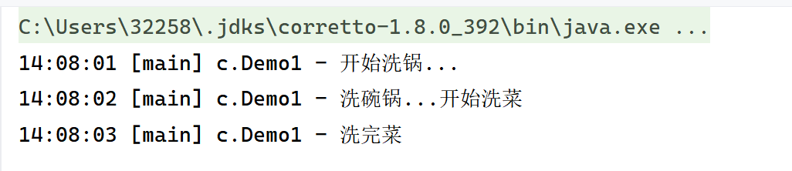

### 异步

不需要等待结果返回就能继续运行实现异步。例如下面同时开始洗菜洗锅。

```
package tu.learn.test;
import lombok.extern.slf4j.Slf4j;

@Slf4j(topic = "c.Demo1")
public class Demo1 {
    public static void main(String[] args) throws InterruptedException {
        new Thread(()->{
            log.debug("开始洗锅...");
            try {
                Thread.sleep(1000);
            } catch (InterruptedException e) {
                throw new RuntimeException(e);
            }
            log.debug("洗完锅...");
        }).start();
        log.debug("开始洗菜");
        Thread.sleep(1000);
        log.debug("洗完菜");
    }
}
```

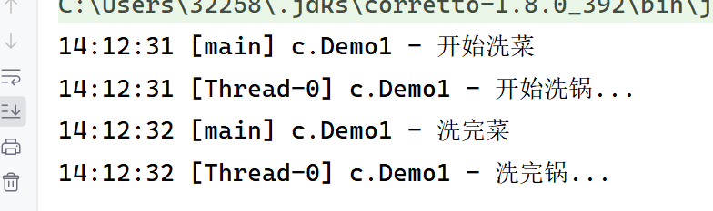


## 二、创建和运行线程练习

### Thread创建

Thread构造方法的参数可以给线程指定名字

```java
package tu.learn.test;

import lombok.extern.slf4j.Slf4j;

@Slf4j(topic = "c.Demo2")
public class Demo2 {
    public static void main(String[] args) {
        Thread t1 = new Thread(){
            @Override
            public void run() {
                log.debug("利用Thread创建线程...");
            }
        };
        t1.start();

        Thread t2 = new Thread("t2"){
            @Override
            public void run() {
                log.debug("利用Thread创建线程t2...");
            }
        };
        t2.start();
    }
}
```

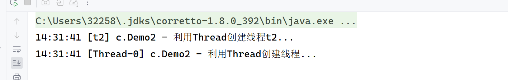

### Runnable配合Thread创建

线程和任务分开

```
package tu.learn.test;

import lombok.extern.slf4j.Slf4j;

@Slf4j(topic = "c.Demo2")
public class Demo2 {
    public static void main(String[] args) {
        Runnable runnable = new Runnable() {
            @Override
            public void run() {
                log.debug("利用Runnale创建任务");
            }
        };

        Thread t = new Thread(runnable);
        t.start();
    }
}
//java8之后的lambda表示
//Runnable runnable = () -> log.debug("利用Runnale创建任务");
//     Thread t = new Thread(runnable);
//    t.start();

```

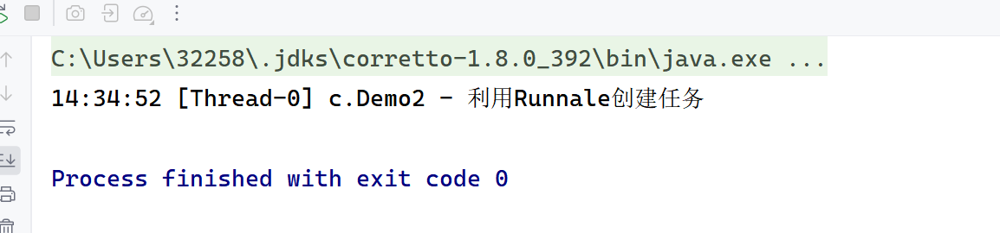

### FutureTask配合Thread创建

能接收Callable类型的参数用来处理有返回结果的情况

```
package tu.learn.test;

import lombok.extern.slf4j.Slf4j;

import java.util.concurrent.ExecutionException;
import java.util.concurrent.FutureTask;

@Slf4j(topic = "c.Demo2")
public class Demo2 {
    public static void main(String[] args) throws ExecutionException, InterruptedException {
        FutureTask<String> task = new FutureTask<>(()->{
            log.debug("FutrueTask创建线程...");
            return "task";
        });

        new Thread(task,"task").start();

        String string = task.get();
        log.debug("结果是{}",string);
    }
}

```

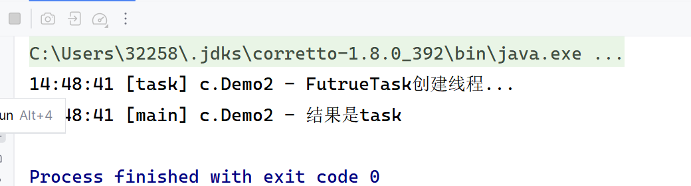

### 调用run方法

还是在main线程运行

```
package tu.learn.test;

import lombok.extern.slf4j.Slf4j;

@Slf4j(topic = "c.Demo3")
public class Demo3 {
    public static void main(String[] args) {
        Thread thread = new Thread("thread"){
            @Override
            public void run() {
                log.debug("调用run方法");
            }
        };
        thread.run();
    }
}
```

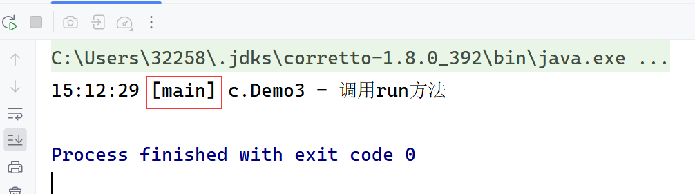

### 调用start方法

在thread线程运行

```
package tu.learn.test;

import lombok.extern.slf4j.Slf4j;

@Slf4j(topic = "c.Demo3")
public class Demo3 {
    public static void main(String[] args) {
        Thread thread = new Thread("thread"){
            @Override
            public void run() {
                log.debug("调用start方法");
            }
        };
//        thread.run();
        thread.start();
    }
}

```

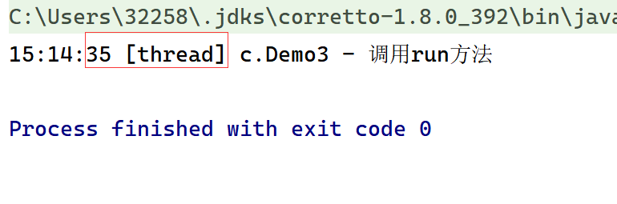

### 调用sleep方法

如何让当前线程从Running状态进入Timed Waiting状态？用sleep

```
package tu.learn.test;

import lombok.extern.slf4j.Slf4j;

@Slf4j(topic = "c.Demo3")
public class Demo3 {
    public static void main(String[] args) throws InterruptedException {
        Thread thread = new Thread("thread"){
            @Override
            public void run() {
                log.debug("开始执行");
                try {
                    Thread.sleep(2000);
                } catch (InterruptedException e) {
                    throw new RuntimeException(e);
                }
                log.debug("结束执行");
            }
        };
   //     thread.run();
        thread.start();
        log.debug("thread state:{}",thread.getState());

        Thread.sleep(1000);
        log.debug("thread state:{}",thread.getState());
    }
    //TimeUnit的sleep可读性比sleep好
}
```

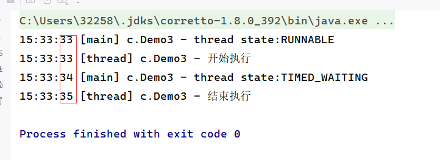

如何打断正在睡眠的线程？用interrupt

```
package tu.learn.test;

import lombok.extern.slf4j.Slf4j;

@Slf4j(topic = "c.Demo3")
public class Demo3 {
    public static void main(String[] args) throws InterruptedException {
        Thread thread = new Thread("thread"){
            @Override
            public void run() {
                log.debug("开始执行");
                try {
                    Thread.sleep(2000);
                } catch (InterruptedException e) {
                    log.debug("醒过来了");
                    e.printStackTrace();
                }
                log.debug("结束执行");
            }
        };
        thread.start();
        log.debug("thread state:{}",thread.getState());

        Thread.sleep(1000);
        thread.interrupt();
        log.debug("thread state:{}",thread.getState());
    }
}
```

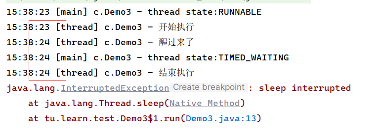

### 调用yield方法

如何让当前线程从Running进入Runnable就绪状态？使用yield

```
package tu.learn.test;

import lombok.extern.slf4j.Slf4j;

import java.util.HashMap;

@Slf4j(topic = "c.Demo4")
public class Demo4 {
    public static void main(String[] args) throws InterruptedException {
        Thread thread = new Thread("thread"){
            @Override
            public void run() {
                log.debug("开始执行");
                Thread.yield();
            }
        };
        thread.start();
        log.debug("thread的state :{}", thread.getState());
        Thread.sleep(1000);
        log.debug("thread的state :{}", thread.getState());
    }
}
```

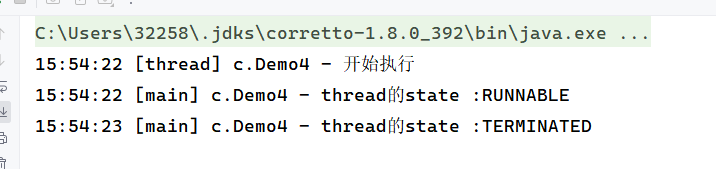

### 调用setPriority方法

如何改变线程优先级？

```
package tu.learn.test;

import lombok.extern.slf4j.Slf4j;

import java.awt.event.HierarchyBoundsAdapter;

@Slf4j(topic = "c.Demo5")
public class Demo5 {
    public static void main(String[] args) {
        Runnable t1 = new Runnable() {
            int count = 0;
            @Override
            public void run() {
                while (true){
                    System.out.println("---1 "+count ++);
                }
            }
        };

        Runnable t2 = new Runnable() {
            int count = 0;
            @Override
            public void run() {
                while (true){
                    System.out.println("---       2 "+count ++);
                }
            }
        };

        Thread thread = new Thread(t1,"t1");
        Thread thread1 = new Thread(t2,"t2");
        //设置优先级
        thread.setPriority(Thread.MIN_PRIORITY);
        thread1.setPriority(Thread.MAX_PRIORITY);
        thread.start();
        thread1.start();
    }
}
```


2优先级更高所以累加得更块。

### 调用join方法

```
package tu.learn.test;

import lombok.extern.slf4j.Slf4j;

@Slf4j(topic = "c.Demo6")
public class Demo6 {
    static int n = 0;
    public static void main(String[] args) throws InterruptedException {
        Thread thread = new Thread(()->{
            try {
                Thread.sleep(1000);
            } catch (InterruptedException e) {
                throw new RuntimeException(e);
            }
            n = 10;
        },"thread");
        thread.start();
        thread.join();
        //thread.join(500);//没等够时间
        //thread.join(1500);//等够时间
        log.debug("n:{}",n);
    }
}
```

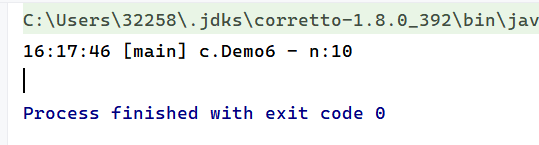

### 调用interrupt、isInterrupted方法

被打断进程正在sleep、wait、join会导致被打断的线程抛出InterruptedException，并清除打断标记为false

```
package tu.learn.test;

import lombok.extern.slf4j.Slf4j;

import static java.lang.Thread.sleep;

@Slf4j(topic = "c.Demo7")
public class Demo7 {
    public static void main(String[] args) throws InterruptedException {
        Thread thread = new Thread(()->{
            try {
                Thread.sleep(1000);
            } catch (InterruptedException e) {
                throw new RuntimeException(e);
            }
        },"thread");
        Thread.sleep(500);
        thread.interrupt();
        log.debug("打断状态：{}",thread.isInterrupted());

    }
}
```


```
Exception in thread "thread" java.lang.RuntimeException: java.lang.InterruptedException: sleep interrupted
	at tu.learn.test.Demo7.lambda$main$0(Demo7.java:14)
	at java.lang.Thread.run(Thread.java:750)
Caused by: java.lang.InterruptedException: sleep interrupted
	at java.lang.Thread.sleep(Native Method)
	at tu.learn.test.Demo7.lambda$main$0(Demo7.java:12)
	... 1 more
16:40:43 [main] c.Demo7 - 打断状态：false
```

打断正在运行的线程，会设置打断标记为true

```
package tu.learn.test;

import lombok.extern.slf4j.Slf4j;

@Slf4j(topic = "c.Demo8")
public class Demo8 {
    public static void main(String[] args) throws InterruptedException {
        Thread thread = new Thread(()->{
            while (true){
                Thread current = Thread.currentThread();
                if(current.isInterrupted()){
                    log.debug("打断状态:{}",current.isInterrupted());
                    break;
                }
            }
        },"thread");
        thread.start();
        Thread.sleep(500);
        thread.interrupt();
    }
}
```

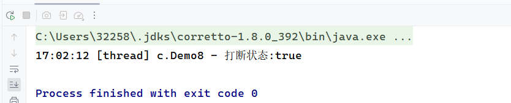

打断park线程，不会清空打断状态。

park函数作用是将当前调用线程阻塞,unpark函数则是将指定线程线程唤醒

```java
package tu.learn.test;

import lombok.extern.slf4j.Slf4j;

import java.util.concurrent.locks.LockSupport;

@Slf4j(topic = "c.Demo10")
public class Demo10 {
    public static void main(String[] args) throws InterruptedException {
        Thread thread = new Thread(()->{
           log.debug("park begin");
            LockSupport.park();
         //   Thread.interrupted();可以将打断状态设置为false
            log.debug("打断状态:{}",Thread.currentThread().isInterrupted());
        },"thread");
        thread.start();
        Thread.sleep(1000);
        thread.interrupt();

    }
}
```

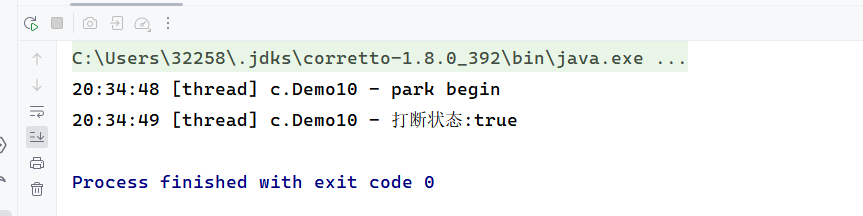

### 使用interrupt和isInterrupted方法实现两阶段终止模式

如何在一个线程T1中终止线程T2？（保证T2终止前能够提前释放资源或做其它操作）

```java
package tu.learn.test;

import lombok.extern.slf4j.Slf4j;

@Slf4j(topic = "c.TPTInterrupt")
class TPTInterrupt{
    private Thread thread;

    public void start(){
        log.debug("开始执行");
        thread = new Thread(()->{
            while (true){
                Thread current = Thread.currentThread();
                boolean isInterrupted = current.isInterrupted();
                if(isInterrupted){
                    log.debug("料理后事");
                    break;
                }

                try {
                    Thread.sleep(2000);
                    log.debug("将结果保存");
                } catch (InterruptedException e) {
                    current.interrupt();
                }

            }
        },"监控线程");
        thread.start();
    }

    public void stop(){
        log.debug("执行stop");
        thread.interrupt();
    }
}
@Slf4j(topic = "c.Demo9")
public class Demo9 {
    public static void main(String[] args) throws InterruptedException {
        TPTInterrupt tptInterrupt = new TPTInterrupt();
        tptInterrupt.start();
        Thread.sleep(6000);
        tptInterrupt.stop();
    }
}
```

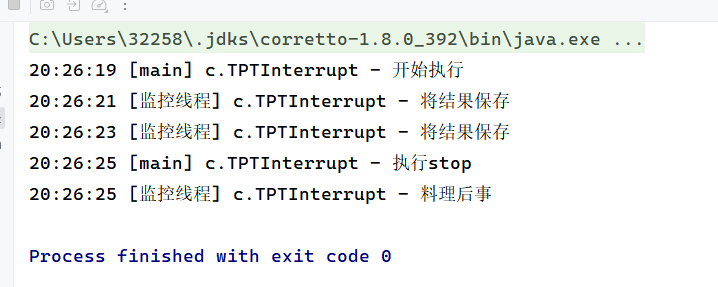

### Other functions

```java
package tu.learn.test;

import jdk.nashorn.internal.ir.WhileNode;
import lombok.extern.slf4j.Slf4j;

@Slf4j(topic = "c.Demo11")
public class Demo11 {
    public static void main(String[] args) {
        Thread thread = new Thread(()-> {while (true){}},"thread");
        thread.start();

        System.out.println(thread.getId());//获取线程长整型id
        System.out.println(thread.getName());//获取线程名
        thread.setName("thread-demo");//修改线程名
        System.out.println(thread.getName());//获取线程名
        System.out.println(thread.getPriority());//获取线程优先级
        System.out.println(thread.isAlive());//线程是否存活
        System.out.println(Thread.currentThread());//获取当前运行线程
    }
}
```

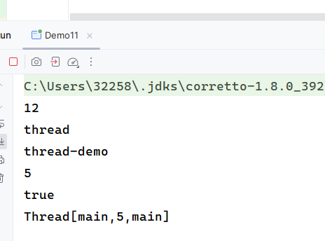

### 实现守护线程

```java
package tu.learn.test;

import com.sun.tracing.dtrace.StabilityLevel;
import lombok.extern.slf4j.Slf4j;

@Slf4j(topic = "c.Demo12")
public class Demo12 {
    public static void main(String[] args) throws InterruptedException {
        Thread thread = new Thread(()->{
           log.debug("开始运行");
            try {
                Thread.sleep(2000);
            } catch (InterruptedException e) {
                throw new RuntimeException(e);
            }
            log.debug("运行结束");
        },"daemon");
        thread.setDaemon(true);//设置为守护线程
        thread.start();
        Thread.sleep(1000);
        log.debug("main 运行结束");
    }
}
```

daemon线程在1s后结束运行

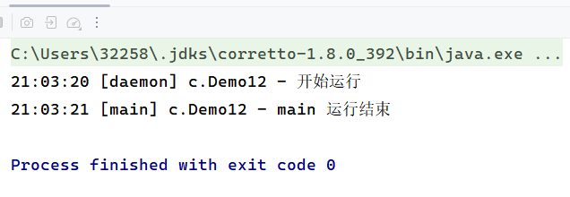

### 烧水泡茶练习

烧水泡茶需要完成下面的工作，如何用最短时间实现该过程？

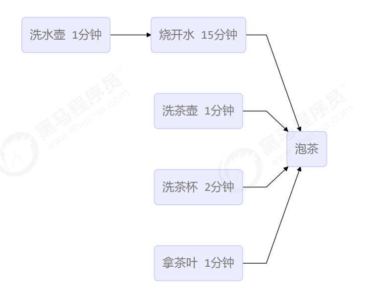

```java
package tu.learn.test;

import lombok.extern.slf4j.Slf4j;

@Slf4j(topic = "c.Demo13")
public class Demo13 {
    public static void main(String[] args) throws InterruptedException {
        Thread thread1 = new Thread(()->{
           log.debug("洗水壶");
            try {
                Thread.sleep(1000);
            } catch (InterruptedException e) {
                throw new RuntimeException(e);
            }
            log.debug("烧开水");
            try {
                Thread.sleep(15000);
            } catch (InterruptedException e) {
                throw new RuntimeException(e);
            }
        },"thread1");

        Thread thread2 = new Thread(()->{
           log.debug("洗茶壶");
            try {
                Thread.sleep(1000);
            } catch (InterruptedException e) {
                throw new RuntimeException(e);
            }
            log.debug("洗茶杯");
            try {
                Thread.sleep(2000);
            } catch (InterruptedException e) {
                throw new RuntimeException(e);
            }
            log.debug("拿茶叶");
            try {
                Thread.sleep(1000);
            } catch (InterruptedException e) {
                throw new RuntimeException(e);
            }
        },"thread2");
        thread1.start();
        thread2.start();
        thread1.join();
        thread2.join();
        log.debug("泡茶");
    }
}
```

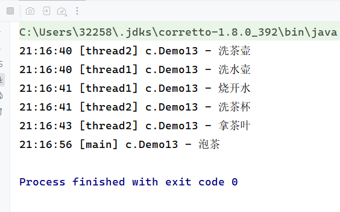

## 三、管程练习

### 使用synchronized

两个线程对初始值为0的静态变量一个做自增、一个做自减，各做5000次，如何保证结果是0？使用synchronized实现对临界区的互斥访问。

```java
package tu.learn.test1;

import lombok.extern.slf4j.Slf4j;

@Slf4j(topic = "c.Demo1")
public class Demo1 {
    static int n = 0;
    public static void main(String[] args) throws InterruptedException {
        Thread t1 = new Thread(()->{
            for (int i = 0; i < 5000; i ++) {
                synchronized (Demo1.class) {
                    n ++;
                }
            }
        },"t1");

        Thread t2 = new Thread(()->{
            for (int i = 0; i < 5000; i ++) {
                synchronized (Demo1.class) {
                    n --;
                }
            }
        },"t2");

        t1.start();
        t2.start();
        t1.join();
        t2.join();
        System.out.println(n);
    }
}
```

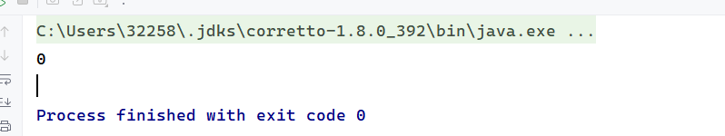

### synchronized思考

synchronized 实际是用**对象锁**保证了**临界区内代码的原子性**，临界区内的代码对外是不可分割的，不会被线程切 换所打断。 为了加深理解，请思考下面的问题：

+ 如果把 synchronized(obj) 放在 for 循环的外面，如何理解？-- 原子性 

任然能保证原子性，只是这里是5000次循环。

+  如果 t1 synchronized(obj1) 而 t2 synchronized(obj2) 会怎样运作？-- 锁对象 

不能保证线程安全执行，对共享资源的保护不是同一个。

+ 如果 t1 synchronized(obj) 而 t2 没有加会怎么样？如何理解？-- 锁对象

不能保证线程安全执行，t2不用获取锁就可以执行 。

### 共享对象面向对象的synchronized实现

将需要保护的对象放入一个类中

```java
package tu.learn.test1;

class Room{
    int n = 0;

    public void increment(){
        synchronized (this){
            n ++;
        }
    }

    public void decrement(){
        synchronized (this){
            n --;
        }
    }

    public int get(){
        synchronized (this){
            return n;
        }
    }
}
public class Demo2 {
    public static void main(String[] args) throws InterruptedException {
        Room room = new Room();
        Thread t1 = new Thread(()->{
            for (int i = 0; i < 5000; i ++) {
                room.increment();
            }
        },"t1");
        Thread t2 = new Thread(()->{
            for (int i = 0; i < 5000; i++) {
                room.decrement();
            }
        },"t2");
        t1.start();
        t2.start();
        t1.join();
        t2.join();
        System.out.println(room.get());
    }
}
```

### 方法上的synchronized实现

等价形式

```java
class Test1{
    public synchronized static void test(){

    }
}

/*
class Test1{
    public static void test(){
        synchronized (Test1.class){

        }
    }
}
*/
```

```java
class Test{
    public synchronized void test(){

    }
}
/*
class Test{
    public void test(){
        synchronized (this){

        }
    }
}
*/
```

### synchronized的”线程八股“

1. 共享对象是当前调用的对象this，main方法中调用的对象都为n1,输出顺序要么为12或21

```java
package tu.learn.test1;

import lombok.extern.slf4j.Slf4j;

@Slf4j(topic = "c.Number")
class Number{
    public synchronized void a() {
        log.debug("1");
    }
    public synchronized void b() {
        log.debug("2");
    }
}
public class Demo4 {
    public static void main(String[] args) {
        Number n1 = new Number();
        new Thread(()->{ n1.a(); }).start();
        new Thread(()->{ n1.b(); }).start();
    }
}
```

2. 与1相同，只是a方法中会先sleep1s，执行顺序为1s后12或2 1s后1

```java
package tu.learn.test1;

import lombok.extern.slf4j.Slf4j;

@Slf4j(topic = "c.Number")
class Number{
    public synchronized void a() throws InterruptedException {
        Thread.sleep(1000);
        log.debug("1");
    }
    public synchronized void b() {
        log.debug("2");
    }
}
public class Demo4 {
    public static void main(String[] args) {
        Number n1 = new Number();
        new Thread(()->{
            try {
                n1.a();
            } catch (InterruptedException e) {
                throw new RuntimeException(e);
            }
        }).start();
        new Thread(()->{ n1.b(); }).start();
    }
}
```

3. 由于c()方法没加锁，且a()方法会sleep1s，故c()方法一定比a()方法先输出。故输出顺序有：3 1s后12，32 1s后1，23 1s后1

```java
package tu.learn.test1;

import lombok.extern.slf4j.Slf4j;

@Slf4j(topic = "c.Number")
class Number{
    public synchronized void a() throws InterruptedException {
        Thread.sleep(1000);
        log.debug("1");
    }
    public synchronized void b() {
        log.debug("2");
    }
    public void c() {
        log.debug("3");
    }
}

public class Demo4 {
    public static void main(String[] args) {
        Number n1 = new Number();
        new Thread(()->{
            try {
                n1.a();
            } catch (InterruptedException e) {
                throw new RuntimeException(e);
            }
        }).start();
        new Thread(()->{ n1.b(); }).start();
        new Thread(()->{ n1.c(); }).start();
    }

}
```

4. 不同对象调用不同方法，a方法先sleep1s，故b()方法先输出，输出顺序为2 1s后1

```java
package tu.learn.test1;

import lombok.extern.slf4j.Slf4j;

@Slf4j(topic = "c.Number")
class Number{
    public synchronized void a() throws InterruptedException {
        Thread.sleep(1000);
        log.debug("1");
    }
    public synchronized void b() {
        log.debug("2");
    }
}

public class Demo4 {
    public static void main(String[] args) {
        Number n1 = new Number();
        Number n2 = new Number();
        new Thread(()->{
            try {
                n1.a();
            } catch (InterruptedException e) {
                throw new RuntimeException(e);
            }
        }).start();
        new Thread(()->{ n2.b(); }).start();
    }

}
```

5. 这里a()方法为static，故对象锁位Number.class,锁对象也不同，输出顺序为2 1s后1

```
package tu.learn.test1;

import lombok.extern.slf4j.Slf4j;

@Slf4j(topic = "c.Number")
class Number{
    public synchronized static void a() throws InterruptedException {
        Thread.sleep(1000);
        log.debug("1");
    }
    public synchronized void b() {
        log.debug("2");
    }
}

public class Demo4 {
    public static void main(String[] args) {
        Number n1 = new Number();
        new Thread(()->{
            try {
                n1.a();
            } catch (InterruptedException e) {
                throw new RuntimeException(e);
            }
        }).start();
        new Thread(()->{ n1.b(); }).start();
    }
}
```

6. 此时的锁对象都为Number.class，所以输出顺序为1s后12，或2 1s后1

```java
package tu.learn.test1;

import lombok.extern.slf4j.Slf4j;

@Slf4j(topic = "c.Number")
class Number{
    public synchronized static void a() throws InterruptedException {
        Thread.sleep(1000);
        log.debug("1");
    }
    public synchronized static void b() {
        log.debug("2");
    }
}

public class Demo4 {
    public static void main(String[] args) {
        Number n1 = new Number();
        
        
        new Thread(()->{
            try {
                n1.a();
            } catch (InterruptedException e) {
                throw new RuntimeException(e);
            }
        }).start();
        new Thread(()->{ n1.b(); }).start();
    }
}
```

7. 锁对象不同，故2先输出，输出顺序为2 1s后1

```java
package tu.learn.test1;

import lombok.extern.slf4j.Slf4j;

@Slf4j(topic = "c.Number")
class Number{
    public synchronized static void a() throws InterruptedException {
        Thread.sleep(1000);
        log.debug("1");
    }
    public synchronized void b() {
        log.debug("2");
    }
}

public class Demo4 {
    public static void main(String[] args) {
        Number n1 = new Number();
        Number n2 = new Number();

        new Thread(()->{
            try {
                n1.a();
            } catch (InterruptedException e) {
                throw new RuntimeException(e);
            }
        }).start();
        new Thread(()->{ n2.b(); }).start();
    }
}
```

8. 都为static方法，锁对象相同，故执行顺序为 2 1s后1或1s后12

```java
package tu.learn.test1;

import lombok.extern.slf4j.Slf4j;

@Slf4j(topic = "c.Number")
class Number{
    public synchronized static void a() throws InterruptedException {
        Thread.sleep(1000);
        log.debug("1");
    }
    public  synchronized static void b() {
        log.debug("2");
    }
}

public class Demo4 {
    public static void main(String[] args) {
        Number n1 = new Number();
        Number n2 = new Number();

        new Thread(()->{
            try {
                n1.a();
            } catch (InterruptedException e) {
                throw new RuntimeException(e);
            }
        }).start();
        new Thread(()->{ n2.b(); }).start();
    }
}
```

### 线程安全实例分析

```java
public class MyServlet extends HttpServlet {
     // 是否安全？不安全
     Map<String,Object> map = new HashMap<>();
     // 是否安全？安全
     String S1 = "...";
     // 是否安全？安全
     final String S2 = "...";
     // 是否安全？不安全
     Date D1 = new Date();
     // 是否安全？不安全
     final Date D2 = new Date();
 
public void doGet(HttpServletRequest request, 		   HttpServletResponse response) {// 使用上述变量}
}
```

```java
public class MyServlet extends HttpServlet {
 // 是否安全？不安全
     private UserService userService = new UserServiceImpl();

     public void doGet(HttpServletRequest request, HttpServletResponse response) {
     	userService.update(...);
     }
}
public class UserServiceImpl implements UserService {
     // 记录调用次数
     private int count = 0;

     public void update() {
         // ...
         count++;
 	 }
}
```

```java
@Aspect
@Component
public class MyAspect {
 // 是否安全？不安全
 private long start = 0L;

 @Before("execution(* *(..))")
 public void before() {
 start = System.nanoTime();
 }

 @After("execution(* *(..))")
 public void after() {
 long end = System.nanoTime();
 System.out.println("cost time:" + (end-start));
 }
}
```

```java
public class MyServlet extends HttpServlet {
 // 是否安全？安全
 private UserService userService = new UserServiceImpl();

 public void doGet(HttpServletRequest request, HttpServletResponse response) {
 userService.update(...);
 }
}
public class UserServiceImpl implements UserService {
 // 是否安全？安全
 private UserDao userDao = new UserDaoImpl();

 public void update() {
 userDao.update();
 }
}
public class UserDaoImpl implements UserDao {
 public void update() {
 String sql = "update user set password = ? where username = ?";
 // 是否安全？是
 try (Connection conn = DriverManager.getConnection("","","")){
 // ...
 } catch (Exception e) {
 // ...
 }
 }
}

```

```java
public class MyServlet extends HttpServlet {
 // 是否安全？否
 private UserService userService = new UserServiceImpl();

 public void doGet(HttpServletRequest request, HttpServletResponse response) {
 userService.update(...);
 }
}
public class UserServiceImpl implements UserService {
 // 是否安全？否
 private UserDao userDao = new UserDaoImpl();

 public void update() {
 userDao.update();
 }
}
public class UserDaoImpl implements UserDao {
 // 是否安全？否
 private Connection conn = null;
 public void update() throws SQLException {
 String sql = "update user set password = ? where username = ?";
 conn = DriverManager.getConnection("","","");
 // ...
 conn.close();
 }
}
```

```java
public class MyServlet extends HttpServlet {
 // 是否安全？是
 private UserService userService = new UserServiceImpl();

 public void doGet(HttpServletRequest request, HttpServletResponse response) {
 userService.update(...);
 }
}
public class UserServiceImpl implements UserService {
 public void update() {
 UserDao userDao = new UserDaoImpl();
 userDao.update();
 }
}
public class UserDaoImpl implements UserDao {
 // 是否安全？是
 private Connection = null;
 public void update() throws SQLException {
 String sql = "update user set password = ? where username = ?";
 conn = DriverManager.getConnection("","","");
 // ...
 conn.close();
 }
}
```

```java
public abstract class Test {

     public void bar() {
     // 是否安全？否，会暴露给其它线程
     SimpleDateFormat sdf = new SimpleDateFormat("yyyy-MM-dd HH:mm:ss");
     foo(sdf);
     }

 	public abstract foo(SimpleDateFormat sdf);


     public static void main(String[] args) {
     	new Test().bar();
     }
}
public void foo(SimpleDateFormat sdf) {
     String dateStr = "1999-10-11 00:00:00";
     for (int i = 0; i < 20; i++) {
         new Thread(() -> {
         try {
         sdf.parse(dateStr);
     } catch (ParseException e) {
     	e.printStackTrace();
     }
     }).start();
     }
}
```

```java
private static Integer i = 0;//不安全
public static void main(String[] args) throws InterruptedException {
 List<Thread> list = new ArrayList<>();
 for (int j = 0; j < 2; j++) {
     Thread thread = new Thread(() -> {
         for (int k = 0; k < 5000; k++) {
         synchronized (i) {
         i++;
         }
     }
 }, "" + j);
 list.add(thread);
 }
 list.stream().forEach(t -> t.start());
     list.stream().forEach(t -> {
         try {
             t.join();
             } catch (InterruptedException e) {
             e.printStackTrace();
         }
     });
  log.debug("{}", i);
}
```

### 卖票练习

实现一个买票系统

```
package tu.learn.test1;

import lombok.extern.slf4j.Slf4j;

import java.util.ArrayList;
import java.util.List;
import java.util.Random;
import java.util.Vector;

@Slf4j(topic = "c.ExerciseSell")
public class ExerciseSell {
    public static void main(String[] args) {
        TicketWindow ticketWindow = new TicketWindow(2000);
        List<Thread> list = new ArrayList<>();

        // 用来存储卖出去多少张票
        List<Integer> sellCount = new Vector<>();
        for (int i = 0; i < 2000; i++) {
            Thread t = new Thread(() -> {
                // 分析这里的竞态条件
                int count = ticketWindow.sell(randomAmount());
                sellCount.add(count);
            });
            list.add(t);
            t.start();
        }
        list.forEach((t) -> {
            try {
                t.join();
            } catch (InterruptedException e) {
                e.printStackTrace();
            }
        });
        // 买出去的票求和
        log.debug("selled count:{}",sellCount.stream().mapToInt(c -> c).sum());
        // 剩余票数
        log.debug("remainder count:{}", ticketWindow.getCount());
    }
    // Random 为线程安全
    static Random random = new Random();
    // 随机 1~5
    public static int randomAmount() {
        return random.nextInt(5) + 1;
    }
}
class TicketWindow {
    private int count;
    public TicketWindow(int count) {
        this.count = count;
    }
    public int getCount() {
//        synchronized (this) {
            return count;
//        }
    }
    public int sell(int amount) {
        synchronized (this) {
            if (this.count >= amount) {
                this.count -= amount;
                return amount;
            } else {
                return 0;
            }
        }
    }
}
```

### 转账练习

实现一个转账系统

```java
package tu.learn.test1;

import lombok.extern.slf4j.Slf4j;

import java.util.Random;

@Slf4j(topic = "c.ExerciseTransfer")
public class ExerciseTransfer {
    public static void main(String[] args) throws InterruptedException {
        Account a = new Account(1000);
        Account b = new Account(1000);

        Thread t1 = new Thread(() -> {
            for (int i = 0; i < 1000; i++) {
                a.transfer(b, randomAmount());
            }
        }, "t1");

        Thread t2 = new Thread(() -> {
            for (int i = 0; i < 1000; i++) {
                b.transfer(a, randomAmount());
            }
        }, "t2");

        t1.start();
        t2.start();
        t1.join();
        t2.join();
        // 查看转账2000次后的总金额
        log.debug("total:{}",(a.getMoney() + b.getMoney()));
    }
    // Random 为线程安全
    static Random random = new Random();
    // 随机 1~100
    public static int randomAmount() {
        return random.nextInt(100) +1;
    }
}
class Account {
    private int money;
    public Account(int money) {
        this.money = money;
    }
    public int getMoney() {
        return money;
    }
    public void setMoney(int money) {
        this.money = money;
    }
    public void transfer(Account target, int amount) {
        synchronized (Account.class){
            if (this.money > amount) {
                this.setMoney(this.getMoney() - amount);
                target.setMoney(target.getMoney() + amount);
            }
        }
    }
}
```

### 使用wait()/notify()/notifyAll()

如何实现线程从Running到 Waiting？使用wait()

如何实现线程从Waiting到Blocking？使用notify()或notifyAll()

```java
package tu.learn.test1;

import lombok.extern.slf4j.Slf4j;

@Slf4j(topic = "c.Demo6")
public class Demo6 {
    final static Object obj = new Object();
    public static void main(String[] args) throws InterruptedException {
        Thread t1 = new Thread(()->{
            synchronized (obj) {
                log.debug("t1开始执行");
                try {
                    log.debug("t1 waiting");
                    obj.wait();
                    //wait(long n) 有时限的等待, 到 n 毫秒后结束等待，或是被 notify,如obj.wait(1000),那么t1线程会提前结束等待
                } catch (InterruptedException e) {
                    throw new RuntimeException(e);
                }
                log.debug("t1结束");
            }
        },"t1") ;

        Thread t2 = new Thread(()->{
            synchronized (obj) {
                log.debug("t2开始执行");
                try {
                    log.debug("t2 waiting");
                    obj.wait();
                } catch (InterruptedException e) {
                    throw new RuntimeException(e);
                }
                log.debug("t2结束");
            }
        },"t2");

        t1.start();
        t2.start();

        Thread.sleep(2000);
        synchronized (obj) {
            log.debug("main 方法中调用notify");
            obj.notify();
//        log.debug("main 方法中调用notifyAll");
//        obj.notifyAll();
        }
    }
}
```

调用notify()

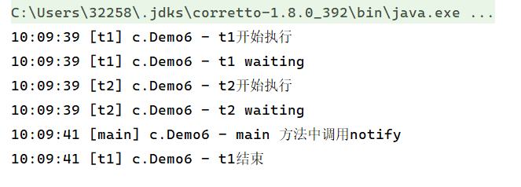

调用notifyAll()

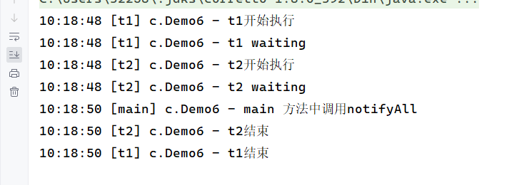

### 对wait和sleep进行比较

+ wait是Object的方法，sleep是Thread的方法
+ wait使用必须与synchronized结合，而sleep不需要
+ wait会释放锁，而sleep不会
+ 它们状态都是TIMED_WAITING

### 同步模式之保护性暂停

使用保护性暂停模式实现一个线程等待另一个线程的执行结果？

```java
package tu.learn.test1;

import lombok.extern.slf4j.Slf4j;

import java.util.ArrayList;
import java.util.List;

@Slf4j(topic = "c.GuardObject")
class GuardObject{
    private Object response;
    private final Object lock = new Object();
    public Object get(){
        synchronized (lock){
            while(response == null){
                try {
                    lock.wait();
                } catch (InterruptedException e) {
                    e.printStackTrace();
                }
            }
            return response;
        }
    }

    public void complete(Object response){
        synchronized (lock) {
            this.response = response;
            lock.notifyAll();
        }
    }
}
@Slf4j(topic = "c.Demo8")
public class Demo8 {
    public static void main(String[] args) {
        GuardObject guardObject = new GuardObject();
        new Thread(()->{
            try {
                Thread.sleep(2000);
            } catch (InterruptedException e) {
                throw new RuntimeException(e);
            }
            List<String> response = new ArrayList<>();
            response.add("aaa");
            response.add("bbb");
            log.debug("传输数据...");
            guardObject.complete(response);
        }).start();

        log.debug("main阻塞");
        Object object = guardObject.get();
        log.debug("获取数据{}",object);
    }
}
```

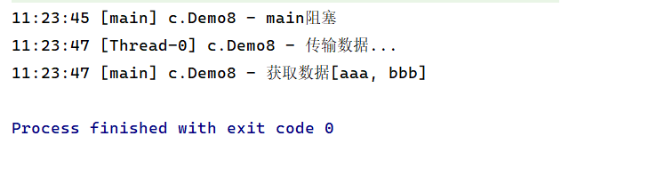

使用保护性暂停模式实现带控制超时时间一个线程等待另一个线程的执行结果？

```java
package tu.learn.test1;

import lombok.extern.slf4j.Slf4j;

import java.util.ArrayList;
import java.util.List;

@Slf4j(topic = "c.GuardObject")
class GuardObject{
    private Object response;
    private final Object lock = new Object();
    public Object get(long millis){
        long begin = System.currentTimeMillis();
        long timePassed = 0;
        synchronized (lock){
            while(response == null){
                try {
                    long waitTime = millis - timePassed;
                    if(waitTime <= 0){
                        log.debug("超时等待，退出");
                        break;
                    }
                    lock.wait(waitTime);
                    timePassed = System.currentTimeMillis() - begin;
                    log.debug("时间：{}被唤醒",timePassed);
                } catch (InterruptedException e) {
                    e.printStackTrace();
                }
            }
            return response;
        }
    }

    public void complete(Object response){
        synchronized (lock) {
            this.response = response;
            lock.notifyAll();
        }
    }
}
@Slf4j(topic = "c.Demo8")
public class Demo8 {
    public static void main(String[] args) {
        GuardObject guardObject = new GuardObject();
        new Thread(()->{
            List<String> response = new ArrayList<>();
            try {
                Thread.sleep(1000);
            } catch (InterruptedException e) {
                throw new RuntimeException(e);
            }
            response.add("aaa");
            response.add("bbb");
            log.debug("传输数据...");
            guardObject.complete(response);
        }).start();

        log.debug("main阻塞");
        Object object = guardObject.get(2000);
        log.debug("获取数据{}",object);
    }
}
```

当获取结果未超时

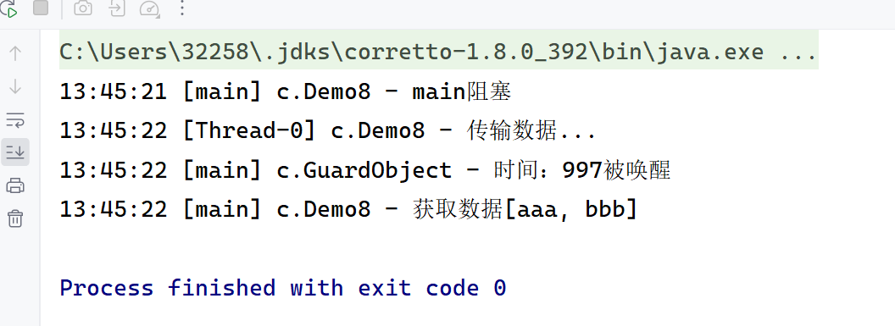

当获取结果超时

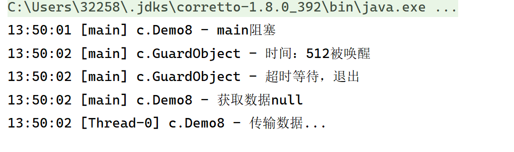

使用GuardedObject实现信箱，使得居民能从信箱取信，邮递员能将信放入信箱。

```java
package tu.learn.test1;

import javafx.geometry.Pos;
import lombok.extern.slf4j.Slf4j;

import java.util.HashMap;
import java.util.Map;
import java.util.Set;


@Slf4j(topic = "c.GuardObject")
class GuardObject{
    private int id;
    public GuardObject(int id){
        this.id = id;
    }

    public int getId() {
        return id;
    }

    private Object response;
//    private final Object lock = new Object();
    public Object get(long millis){
        long begin = System.currentTimeMillis();
        long timePassed = 0;
        synchronized (this){
            while(response == null){
                try {
                    long waitTime = millis - timePassed;
                    if(waitTime <= 0){
                        log.debug("超时等待，退出");
                        break;
                    }
                    this.wait(waitTime);
                    timePassed = System.currentTimeMillis() - begin;
                    log.debug("时间：{}被唤醒",timePassed);
                } catch (InterruptedException e) {
                    e.printStackTrace();
                }
            }
            return response;
        }
    }

    public void complete(Object response){
        synchronized (this) {
            this.response = response;
            this.notifyAll();
        }
    }
}
class Mailboxes{
    private static Map<Integer,GuardObject> boxes = new HashMap<>();

    private static int id = 1;

    //产生唯一id
    private static synchronized int generateId(){
        return id ++;
    }

    public static GuardObject getGuardObject(int id){
        return boxes.remove(id);
    }

    public static GuardObject createGuardObject(){
        GuardObject go = new GuardObject(generateId());
        boxes.put(go.getId(),go);
        return go;
    }

    public static Set<Integer> getIds(){
        return boxes.keySet();
    }
}
@Slf4j(topic = "c.People")
class People extends Thread{
    @Override
    public void run() {
        //收信
        GuardObject guardObject = Mailboxes.createGuardObject();
        log.debug("开始收信 id：{}",guardObject.getId());
        Object mail = guardObject.get(5000);
        log.debug("收到信 id：{},内容：{}",guardObject.getId(),mail);
    }
}
@Slf4j(topic = "c.Postman")
class Postman extends Thread{
    private int id;
    private  String mail;
    public Postman(int id,String mail){
        this.id = id;
        this.mail = mail;
    }
    @Override
    public void run() {
        GuardObject guardObject1 = Mailboxes.getGuardObject(id);
        log.debug("送信 id:{}，内容", id, mail);
        guardObject1.complete(mail);
    }
}
@Slf4j(topic = "c.Demo9")
public class Demo9 {
    public static void main(String[] args) throws InterruptedException {
        for (int i = 0; i < 3; i ++){
            People people = new People();
            people.start();
        }
        Thread.sleep(1000);
        Set<Integer> ids = Mailboxes.getIds();
        for (Integer id : ids) {
            Postman postman = new Postman(id,"发送给id为"+id+"的用户");
            postman.start();
        }
    }
}
```

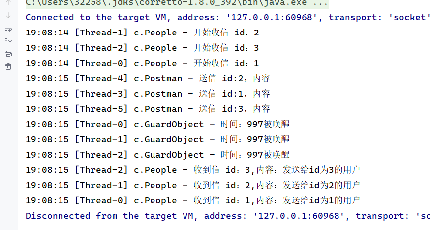

### 生产者/消费者模式

完成生产者和消费者问题。

```java
package tu.learn.test1;

import lombok.extern.slf4j.Slf4j;

import java.util.LinkedList;

class Message{
    private int id;
    private Object message;

    public Message(int id, Object message) {
        this.id = id;
        this.message = message;
    }
    public int getId(){
        return id;
    }
    public Object getMessage(){
        return message;
    }
}
@Slf4j(topic = "c.MessageQueue")
class MessageQueue{
    private LinkedList<Message> queue;
    int capacity;

    public MessageQueue(int capacity) {
        this.capacity = capacity;
        this.queue = new LinkedList<>();
    }

    public Message take(){
        synchronized (queue){
            while(queue.isEmpty()){
                log.debug("队列为空");
                try {
                    queue.wait();
                } catch (InterruptedException e) {
                    e.printStackTrace();
                }
            }
            Message message = queue.removeFirst();
            queue.notifyAll();
            return message;
        }
    }

    public void put(Message message) {
        synchronized (queue){
            while(queue.size() == capacity){
                log.debug("队列满了");
                try {
                    queue.wait();
                } catch (InterruptedException e) {
                    e.printStackTrace();
                }
            }
            log.debug("放入了信息：{}",message);
            queue.addLast(message);
            queue.notifyAll();
        }
    }
}
@Slf4j(topic = "c.Demo10")
public class Demo10 {
    public static void main(String[] args) {
        MessageQueue messageQueue = new MessageQueue(2);
        //定义4个生产者
        for (int i = 0; i < 4; i ++){
            int id = i;
            Thread thread = new Thread(()->{
                Message message = new Message(id, "消息"+id);
               messageQueue.put(message);
            },"生产者"+id);
            thread.start();
        }

        //定义一个消费者
        Thread thread = new Thread(()->{
            while (true){
                Message message = messageQueue.take();
                log.debug("获得消息{}",message);
            }
        },"消费者");
        thread.start();
    }
}
```

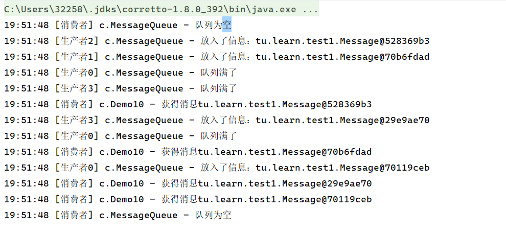

### 使用park/unpark

如何暂停某个线程再恢复某个线程？

暂停当前线程？使用park

恢复某个线程的运行？使用unpark

```java
package tu.learn.test1;

import lombok.extern.slf4j.Slf4j;

import java.util.concurrent.locks.LockSupport;

@Slf4j(topic = "c.Demo11")
public class Demo11 {
    public static void main(String[] args) throws InterruptedException {
        Thread thread = new Thread(()->{
           log.debug("start...");
            try {
                Thread.sleep(1000);
            } catch (InterruptedException e) {
                throw new RuntimeException(e);
            }
            log.debug("park...");
            LockSupport.park();
            log.debug("resume...");
        },"thread");
        thread.start();

        Thread.sleep(2000);
        log.debug("unpark...");
        LockSupport.unpark(thread);
    }
}
```

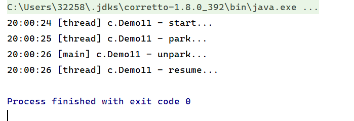

### park/unpark 与wait/notify比较

+ wait，notify和notifyAll必须配合Object Monitor一起使用，而park，unpark不用。
+ park&unpark以线程为单位来阻塞和唤醒线程，而notify只能随机唤醒一个等待线程，notifyAll是唤醒所有等待线程。
+ park&unpark可以先unpark，而wait&notify不能先notify

### 线程状态转换

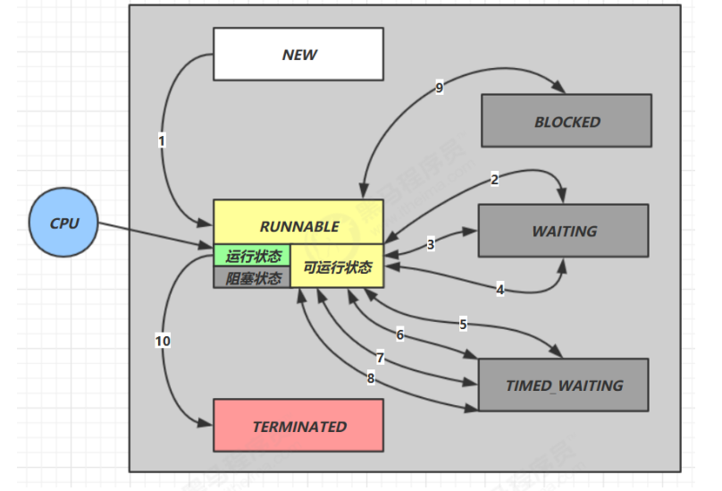

1. NEW-->RUNNABLE：调用t.start方法，由 NEW --> RUNNABLE

2. RUNNABLE<-->WAITING：

   t线程用synchronized(obj)获取锁后调用wait方法，t线程从RUNNABLE --> WAITING

   当调用notify、notifyAll、interrupt方法时，

   竞争锁成功，t线程从WAITING-->RUNNABLE

   竞争锁失败，t线程从WAITING-->BLOCKED

3. RUNNABLE <--> WAITING：当前线程调用 t.join() 方法时，当前线程从 RUNNABLE --> WAITING，t线程运行结束，或调用了当前线程的interrupt()时，当前线程从WAITING-->RUNNABLE

4. RUNNABLE <--> WAITING：当前线程调用 LockSupport.park() 方法会让当前线程从 RUNNABLE --> WAITING ，调用 LockSupport.unpark(目标线程) 或调用了线程的 interrupt() ，会让目标线程从 WAITING --> RUNNABLE

5. RUNNABLE <--> TIMED_WAITING：t 线程用 synchronized(obj) 获取了对象锁后调用 obj.wait(long n) 方法时，t 线程从 RUNNABLE --> TIMED_WAITING， t 线程等待时间超过了 n 毫秒，或调用 obj.notify() ， obj.notifyAll() ， t.interrupt() 时 ，竞争锁成功，t 线程从 TIMED_WAITING --> RUNNABLE ，竞争锁失败，t 线程从 TIMED_WAITING --> BLOCKED。

6. RUNNABLE <--> TIMED_WAITING：当前线程调用 t.join(long n) 方法时，当前线程从 RUNNABLE --> TIMED_WAITING， 注意是当前线程在t 线程对象的监视器上等待， 当前线程等待时间超过了 n 毫秒，或t 线程运行结束，或调用了当前线程的 interrupt() 时，当前线程从 TIMED_WAITING --> RUNNABLE

7. RUNNABLE <--> TIMED_WAITING：当前线程调用 Thread.sleep(long n) ，当前线程从 RUNNABLE --> TIMED_WAITING ，当前线程等待时间超过了 n 毫秒，当前线程从 TIMED_WAITING --> RUNNABLE。

8.  RUNNABLE <--> TIMED_WAITING：当前线程调用 LockSupport.parkNanos(long nanos) 或 LockSupport.parkUntil(long millis) 时，当前线程从 RUNNABLE --> TIMED_WAITING， 调用 LockSupport.unpark(目标线程) 或调用了线程的 interrupt() ，或是等待超时，会让目标线程从 TIMED_WAITING--> RUNNABL

9. RUNNABLE <--> BLOCKED：t 线程用 synchronized(obj) 获取了对象锁时如果竞争失败，从 RUNNABLE --> BLOCKED 持 obj 锁线程的同步代码块执行完毕，会唤醒该对象上所有 BLOCKED 的线程重新竞争，如果其中 t 线程竞争成功，从 BLOCKED --> RUNNABLE ，其它失败的线程仍然 BLOCKED

10. RUNNABLE <--> TERMINATED：当前线程所有代码运行完毕，进入 TERMINATED

### 实现一个死锁

```java
package tu.learn.test1;

import lombok.extern.slf4j.Slf4j;
import org.omg.CORBA.OBJ_ADAPTER;

@Slf4j(topic = "c.Demo12")
public class Demo12 {
    public static void main(String[] args) {
        Object A = new Object();
        Object B = new Object();
        Thread t1 = new Thread(()->{
            synchronized (A){
                log.debug("t1获得A锁");
                synchronized (B){
                    log.debug("t1获得B锁");
                }
            }
        },"t1");
        Thread t2 = new Thread(()->{
            synchronized (B){
                log.debug("t2获得B锁");
                synchronized (A){
                    log.debug("t2获得A锁");
                }
            }
        },"t2");
        t1.start();
        t2.start();
    }
}
```

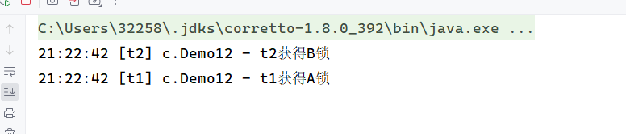

### 实现哲学家就餐问题的死锁

有五位哲学家，围坐在圆桌旁。 他们只做两件事，思考和吃饭，思考一会吃口饭，吃完饭后接着思考。 吃饭时要用两根筷子吃，桌上共有 5 根筷子，每位哲学家左右手边各有一根筷子。 如果筷子被身边的人拿着，自己就得等待。请实现该死锁过程。

```java
package tu.learn.test1;

import lombok.extern.slf4j.Slf4j;

import java.util.logging.Level;

class Chopstick{
    String name;

    public Chopstick(String name) {
        this.name = name;
    }

    @Override
    public String toString() {
        return "Chopstick{" +
                "name='" + name + '\'' +
                '}';
    }
}
@Slf4j(topic = "c.Philosopher")
class Philosopher extends Thread{
    Chopstick left;
    Chopstick right;

    public Philosopher(String name, Chopstick left, Chopstick right) {
        super(name);
        this.left = left;
        this.right = right;
    }

    private void eat() throws InterruptedException {
        log.debug("eating...");
        Thread.sleep(1000);
    }

    @Override
    public void run() {
        while (true){
            synchronized (left){
                log.debug("获得左边筷子");
                synchronized (right){
                    log.debug("获得右边筷子");
                    try {
                        eat();
                    } catch (InterruptedException e) {
                        e.printStackTrace();
                    }
                }
            }
        }
    }
}
@Slf4j(topic = "c.Demo13")
public class Demo13 {
    public static void main(String[] args) {
        Chopstick c1 = new Chopstick("1");
        Chopstick c2 = new Chopstick("2");
        Chopstick c3 = new Chopstick("3");
        Chopstick c4 = new Chopstick("4");
        Chopstick c5 = new Chopstick("5");

        new Philosopher("苏格拉底", c1, c2).start();
        new Philosopher("柏拉图", c2, c3).start();
        new Philosopher("亚里士多德", c3, c4).start();
        new Philosopher("赫拉克利特", c4, c5).start();
        new Philosopher("阿基米德", c5, c1).start();
    }
}
```


### 实现一个活锁

活锁出现在两个线程互相改变对方的结束条件，最后谁也无法结束。

```java
package tu.learn.test1;

import lombok.extern.slf4j.Slf4j;

@Slf4j(topic = "c.Demo14")
public class Demo14 {
    static volatile int count = 10;
    static final Object lock = new Object();
    public static void main(String[] args) {
        new Thread(()->{
            while (count > 0){
                try {
                    Thread.sleep(200);
                    count --;
                    log.debug("count：{}",count);
                } catch (InterruptedException e) {
                    e.printStackTrace();
                }
            }
        },"t1").start();

        new Thread(()->{
            while (count < 20){
                try {
                    Thread.sleep(200);
                    count ++;
                    log.debug("count：{}",count);
                } catch (InterruptedException e) {
                    e.printStackTrace();
                }
            }
        },"t2").start();
    }
}
```

### ReentrantLock特点

实现可重入

```java
package tu.learn.test1;

import lombok.extern.slf4j.Slf4j;

import java.util.concurrent.locks.ReentrantLock;

@Slf4j(topic = "c.Demo15")
public class Demo15 {
    static ReentrantLock lock = new ReentrantLock();
    public static void main(String[] args) {
        method1();
    }
    public static void method1(){
        lock.lock();
        try{
            log.debug("execute method1");
            method2();
        }finally {
            lock.unlock();
        }
    }
    public static void method2(){
        lock.lock();
        try{
            log.debug("execute method2");
            method3();
        }finally {
            lock.unlock();
        }
    }
    public static void method3(){
        lock.lock();
        try{
            log.debug("execute method3");
        }finally {
            lock.unlock();
        }
    }
}
```

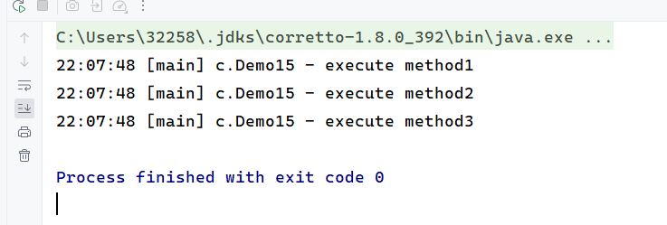

实现可打断

```
package tu.learn.test1;

import lombok.extern.slf4j.Slf4j;

import java.util.concurrent.locks.ReentrantLock;

@Slf4j(topic = "c.Demo16")
public class Demo16 {
    public static void main(String[] args) throws InterruptedException {
        ReentrantLock lock = new ReentrantLock();
        Thread t1 = new Thread(()->{
            log.debug("t1启动");
            try {
                lock.lockInterruptibly();
                //如果这里使用lock.lock();这里是不能打断的
                try{
                    log.debug("获得了锁");
                }finally {
                    lock.unlock();
                }
            } catch (InterruptedException e) {
                e.printStackTrace();
                log.debug("等锁的过程中被打断");
            }
        },"t1");

        lock.lock();
        log.debug("获得了锁");
        t1.start();

        try{
            Thread.sleep(1000);
            t1.interrupt();
            log.debug("执行打断");
        }finally {
            lock.unlock();
        }
    }
}
```

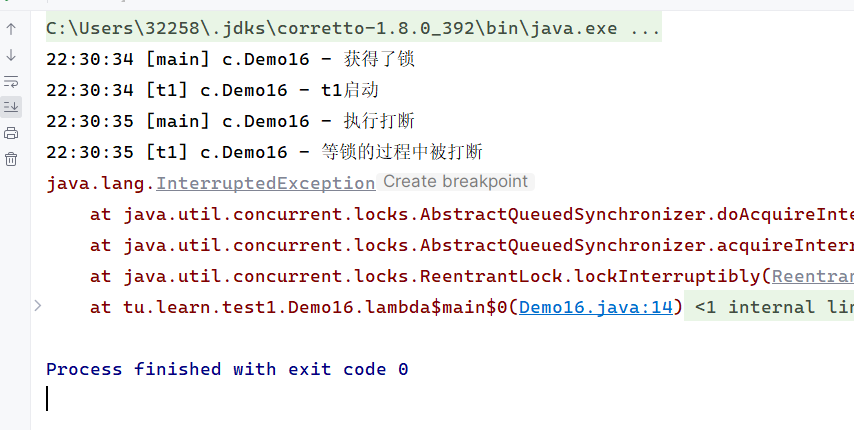

实现锁超时

```
package tu.learn.test1;

import lombok.extern.slf4j.Slf4j;

import java.util.concurrent.locks.ReentrantLock;

@Slf4j(topic = "c.Demo16")
public class Demo16 {
    public static void main(String[] args) throws InterruptedException {
        ReentrantLock lock = new ReentrantLock();
        Thread t1 = new Thread(()->{
            log.debug("t1启动,尝试获得锁");
            if(!lock.tryLock()){
                log.debug("获取不到锁");
                return;
            }
            try{
                log.debug("获得到锁");
            }finally {
                lock.unlock();
            }
        },"t1");

        lock.lock();
        log.debug("获得了锁");
        t1.start();

        try{
            Thread.sleep(1000);
            t1.interrupt();
            log.debug("执行打断");
        }finally {
            lock.unlock();
        }
    }
}

```

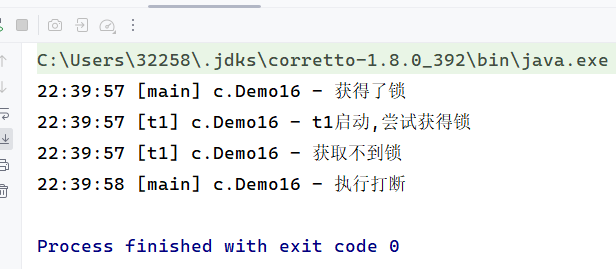

使用tryLock解决哲学家就餐问题的死锁

```java
package tu.learn.test1;

import lombok.extern.slf4j.Slf4j;

import java.util.concurrent.locks.ReentrantLock;
import java.util.logging.Level;

class Chopstick extends ReentrantLock {
    String name;

    public Chopstick(String name) {
        this.name = name;
    }

    @Override
    public String toString() {
        return "Chopstick{" +
                "name='" + name + '\'' +
                '}';
    }
}
@Slf4j(topic = "c.Philosopher")
class Philosopher extends Thread{
    Chopstick left;
    Chopstick right;

    public Philosopher(String name, Chopstick left, Chopstick right) {
        super(name);
        this.left = left;
        this.right = right;
    }

    private void eat() throws InterruptedException {
        log.debug("eating...");
        Thread.sleep(1000);
    }

    @Override
    public void run() {
        while (true){
            if(left.tryLock()){
                try{
                    if(right.tryLock()){
                        try {
                            try {
                                eat();
                            } catch (InterruptedException e) {
                                e.printStackTrace();
                            }
                        }finally {
                            right.unlock();
                        }
                    }
                }finally {
                    left.unlock();
                }
            }
        }
    }
}
@Slf4j(topic = "c.Demo13")
public class Demo13 {
    public static void main(String[] args) {
        Chopstick c1 = new Chopstick("1");
        Chopstick c2 = new Chopstick("2");
        Chopstick c3 = new Chopstick("3");
        Chopstick c4 = new Chopstick("4");
        Chopstick c5 = new Chopstick("5");

        new Philosopher("苏格拉底", c1, c2).start();
        new Philosopher("柏拉图", c2, c3).start();
        new Philosopher("亚里士多德", c3, c4).start();
        new Philosopher("赫拉克利特", c4, c5).start();
        new Philosopher("阿基米德", c5, c1).start();
    }
}
```

实现公平锁

```
package tu.learn.test1;

import lombok.extern.slf4j.Slf4j;

import java.util.concurrent.locks.ReentrantLock;

@Slf4j(topic = "c.Demo17")
public class Demo17 {
    public static void main(String[] args) throws InterruptedException {
        ReentrantLock lock = new ReentrantLock(true);
        lock.lock();
        for (int i = 0; i < 500; i++) {
            new Thread(() -> {
                lock.lock();
                try {
                    System.out.println(Thread.currentThread().getName() + " running...");
                } finally {
                    lock.unlock();
                }
            }, "t" + i).start();
        }
        // 1s 之后去争抢锁
        Thread.sleep(1000);
        new Thread(() -> {
            System.out.println(Thread.currentThread().getName() + " start...");
            lock.lock();
            try {
                System.out.println(Thread.currentThread().getName() + " running...");
            } finally {
                lock.unlock();
            }
        }, "强行插入").start();
        lock.unlock();
    }
}
```

条件变量

实现ReentrantLock的多个条件变量

```
package tu.learn.test1;

import lombok.extern.slf4j.Slf4j;

import java.util.concurrent.locks.Condition;
import java.util.concurrent.locks.ReentrantLock;

@Slf4j(topic = "c.Demo18")
public class Demo18 {
    static ReentrantLock lock = new ReentrantLock();
    static Condition waitCigaretteQueue = lock.newCondition();
    static Condition waitBreakfastQueue = lock.newCondition();
    static volatile boolean hasCigarette = false;
    static volatile boolean hasBreakfast = false;
    public static void main(String[] args) {
        new Thread(()->{
            lock.lock();
            try{
                while (!hasCigarette){
                    try{
                        waitCigaretteQueue.await();
                    }catch (InterruptedException e){
                        e.printStackTrace();
                    }
                }
                log.debug("等到了烟");
            }finally {
                lock.unlock();
            }
        },"t1").start();
        new Thread(()->{
            lock.lock();
            try{
                while (!hasBreakfast){
                    try {
                        //await前需要获得锁，
                        // await执行后会释放锁，进入conditionObject等待
                        //await的线程被唤醒（或打断、或超时）去重新竞争lock锁
                        //竞争lock锁成功后，从await后继续执行
                        waitBreakfastQueue.await();
                    }catch (InterruptedException e){
                        e.printStackTrace();
                    }
                }
                log.debug("等到了早饭");
            }finally {
                //
                lock.unlock();
            }
        },"t2").start();

        sendBreakfast();
        sendCigarette();
    }
    private static void sendCigarette(){
        lock.lock();
        try {
            log.debug("送烟来了");
            hasCigarette = true;
            waitCigaretteQueue.signal();
        }finally {
            lock.unlock();
        }
    }

    private static void sendBreakfast(){
        lock.lock();
        try {
            log.debug("送早餐来了");
            hasBreakfast = true;
            waitBreakfastQueue.signal();
        }finally {
            lock.unlock();
        }
    }
}
```

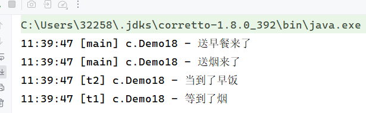

### 实现固定顺序输出

先输出2后输出1

使用wait和notifyAll实现

```java
package tu.learn.test1;

import lombok.extern.slf4j.Slf4j;

@Slf4j(topic = "c.Demo19")
public class Demo19 {
    static Object object = new Object();
    static boolean t2runed = false;
    public static void main(String[] args) {
        Thread t1 = new Thread(()->{
            synchronized (object){
                while(!t2runed){
                    try {
                        object.wait();
                    } catch (InterruptedException e) {
                        e.printStackTrace();
                    }
                }
                log.debug("1");
            }
        },"t1");

        Thread t2 = new Thread(()->{
            synchronized (object){
                log.debug("2");
                t2runed = true;
                object.notifyAll();
            }
        },"t2");

        t1.start();
        t2.start();
    }
}
```

使用park和unpark实现

```java
package tu.learn.test1;

import lombok.extern.slf4j.Slf4j;

import java.util.concurrent.locks.LockSupport;

@Slf4j(topic = "c.Demo20")
public class Demo20 {
    public static void main(String[] args) {
        Thread t1 = new Thread(()->{
            LockSupport.park();
                log.debug("1");
            },"t1");

        Thread t2 = new Thread(()->{
            log.debug("2");
            LockSupport.unpark(t1);
        },"t2");

        t1.start();
        t2.start();
    }
}
```

### 实现交替顺序输出

线程 1 输出 a 5 次，线程 2 输出 b 5 次，线程 3 输出 c 5 次。现在要求输出 abcabcabcabcabc 怎么实现？

wait/notify实现

```java
package tu.learn.test1;

import lombok.extern.slf4j.Slf4j;

class SyncWaitNotify{
    private int flag;
    private int loopNumber;

    public SyncWaitNotify(int flag, int loopNumber) {
        this.flag = flag;
        this.loopNumber = loopNumber;
    }

    public void print(int waitFlag,int nextFlag,String str) throws InterruptedException {
        for(int i = 0; i < loopNumber; i ++){
            synchronized (this){
                while (flag != waitFlag){
                    this.wait();
                }
                System.out.print(str);
                flag = nextFlag;
                this.notifyAll();
            }
        }
    }
}
@Slf4j(topic = "c.Demo21")
public class Demo21 {
    public static void main(String[] args) {
        SyncWaitNotify syncWaitNotify = new SyncWaitNotify(1,5);
        new Thread(()->{
            try {
                syncWaitNotify.print(1,2,"a");
            } catch (InterruptedException e) {
                throw new RuntimeException(e);
            }
        }).start();

        new Thread(()->{
            try {
                syncWaitNotify.print(2,3,"b");
            } catch (InterruptedException e) {
                throw new RuntimeException(e);
            }
        }).start();
        new Thread(()->{
            try {
                syncWaitNotify.print(3,1,"c");
            } catch (InterruptedException e) {
                throw new RuntimeException(e);
            }
        }).start();
    }
}
```

使用Lock条件版实现

```java
package tu.learn.test1;

import lombok.extern.slf4j.Slf4j;

import java.util.concurrent.locks.Condition;
import java.util.concurrent.locks.ReentrantLock;

@Slf4j(topic = "c.AwaitSignal")
class AwaitSignal extends ReentrantLock {
    private int loopNumber;

    public AwaitSignal(int loopNumber) {
        this.loopNumber = loopNumber;
    }

    public void start(Condition first){
        this.lock();
        try {
            log.debug("start");
            first.signal();
        } finally {
            this.unlock();
        }
    }

    public void print(String str, Condition current,Condition next){
        for(int i =0; i < loopNumber; i ++){
            this.lock();
            try {
                current.await();
                log.debug(str);
                next.signal();
            } catch (InterruptedException e) {
                e.printStackTrace();
            }finally {
                this.unlock();
            }
        }
    }
}
@Slf4j(topic = "c.Demo22")
public class Demo22 {
    public static void main(String[] args) {
        AwaitSignal awaitSignal = new AwaitSignal(5);
        Condition aWaitSet = awaitSignal.newCondition();
        Condition bWaitSet = awaitSignal.newCondition();
        Condition cWaitSet = awaitSignal.newCondition();

        new Thread(()->{
            awaitSignal.print("a",aWaitSet,bWaitSet);
        }).start();
        new Thread(()->{
            awaitSignal.print("b",bWaitSet,cWaitSet);
        }).start();
        new Thread(()->{
            awaitSignal.print("c",cWaitSet,aWaitSet);
        }).start();

        awaitSignal.start(aWaitSet);
    }
}
```

利用park/unpark实现

```java
package tu.learn.test1;

import jdk.jfr.internal.instrument.ThrowableTracer;
import lombok.extern.slf4j.Slf4j;

import java.util.concurrent.locks.Lock;
import java.util.concurrent.locks.LockSupport;

class SyncPark{
    private int loopNumber;
    private Thread[] threads;

    public SyncPark(int loopNumber){
        this.loopNumber = loopNumber;
    }

    public void setThreads(Thread... threads){
        this.threads = threads;
    }

    public void print(String str){
        for(int i = 0; i < loopNumber; i ++){
            LockSupport.park();
            System.out.print(str);
            LockSupport.unpark(nextThread());
        }
    }

    private Thread nextThread() {
        Thread current = Thread.currentThread();
        for(int i = 0; i < threads.length; i ++){
            if(threads[i] == current){
                return threads[(i + 1) % threads.length];
            }
        }
        return null;
    }

    public void start(){
        for (Thread thread : threads) {
            thread.start();
        }
        LockSupport.unpark(threads[0]);
    }
}
@Slf4j(topic = "c.Demo23")
public class Demo23 {
    public static void main(String[] args) {
        SyncPark syncPark = new SyncPark(5);
        Thread t1 = new Thread(()->{
            syncPark.print("a");
        });

        Thread t2 = new Thread(()->{
            syncPark.print("b");
        });

        Thread t3 = new Thread(()->{
            syncPark.print("c");
        });

        syncPark.setThreads(t1,t2,t3);
        syncPark.start();
    }
}
```

使用volatile实现两阶段终止模式

```java
package tu.learn.test2;

import lombok.extern.slf4j.Slf4j;

@Slf4j(topic = "c.TPTVolatile")
class TPTVolatile{
    private Thread thread;
    private  volatile  boolean stop = false;

    public void start(){
       thread = new Thread(()->{
           while (true){
               if(stop){
                   log.debug("料理后事");
                   break;
               }
               try {
                   Thread.sleep(1000);
                   log.debug("running");
               } catch (InterruptedException e) {

               }

           }
       },"监控线程");
       thread.start();
    }

    public void stop(){
        stop = true;
        thread.interrupt();
    }
}
@Slf4j(topic = "c.Demo1")
public class Demo1 {
    public static void main(String[] args) throws InterruptedException {
        TPTVolatile t = new TPTVolatile();
        t.start();

        Thread.sleep(3000);
        log.debug("stop");
        t.stop();
    }
}
```

### 使用volatile实现两阶段终止模式

```java
package tu.learn.test2;

import lombok.extern.slf4j.Slf4j;

@Slf4j(topic = "c.TPTVolatile")
class TPTVolatile{
    private Thread thread;
    private  volatile  boolean stop = false;

    public void start(){
       thread = new Thread(()->{
           while (true){
               if(stop){
                   log.debug("料理后事");
                   break;
               }
               try {
                   Thread.sleep(1000);
               } catch (InterruptedException e) {

               }
               log.debug("running");
           }
       },"监控线程");
       thread.start();
    }

    public void stop(){
        stop = true;
        thread.interrupt();
    }
}
@Slf4j(topic = "c.Demo1")
public class Demo1 {
    public static void main(String[] args) throws InterruptedException {
        TPTVolatile t = new TPTVolatile();
        t.start();

        Thread.sleep(3000);
        log.debug("stop");
        t.stop();
    }
}
```

## 四、共享模式之无锁

### 实现一个无锁的例子

```java
package tu.learn.test2;
import lombok.extern.slf4j.Slf4j;

import java.util.concurrent.atomic.AtomicInteger;

@Slf4j(topic = "c.Demo2")
public class Demo2 {
    public static void main(String[] args) {
        AtomicInteger balance = new AtomicInteger(10000);
        int mainPrev = balance.get();
        log.debug("try get {}", mainPrev);
        new Thread(() -> {
            sleep(1000);
            int prev = balance.get();
            balance.compareAndSet(prev, 9000);
            log.debug(balance.toString());
        }, "t1").start();
        sleep(2000);
        log.debug("try set 8000...");
        boolean isSuccess = balance.compareAndSet(mainPrev, 8000);
        log.debug("is success ? {}", isSuccess);
        if(!isSuccess){
            mainPrev = balance.get();
            log.debug("try set 8000...");
            isSuccess = balance.compareAndSet(mainPrev, 8000);
            log.debug("is success ? {}", isSuccess);
        }
    }
    private static void sleep(int millis) {
        try {
            Thread.sleep(millis);
        } catch (InterruptedException e) {
            e.printStackTrace();
        }
    }
}

```

### 原子整数

包括AtomicBoolean、AtomicInteger、AtomicLong，以AtomicInteger为例展示相关操作。

```
package tu.learn.test2;

import lombok.extern.slf4j.Slf4j;

import java.util.concurrent.atomic.AtomicInteger;

@Slf4j(topic = "c.Demo3")
public class Demo3 {
    public static void main(String[] args) {
        AtomicInteger i = new AtomicInteger(0);//i=0;
        System.out.println(i.getAndIncrement());//输出0，i=1
        System.out.println(i.decrementAndGet());//输出0，i=0
        System.out.println(i.getAndAdd(5));//输出0，i=5
        System.out.println(i.addAndGet(-5));//输出0，i=0
        System.out.println(i.getAndUpdate(p->p-2));//输出0，i=-2
        System.out.println(i.getAndAccumulate(10,(p,x)->p+x));//输出-2，i=8
    }
}
```

### 原子引用

包括AtomicReference、AtomicMarkableReference、AtomicStampedReference

利用原子引用保证账户取钱的安全实现。

```java
package tu.learn.test2;

import lombok.extern.slf4j.Slf4j;

import java.math.BigDecimal;
import java.util.ArrayList;
import java.util.List;
import java.util.concurrent.atomic.AtomicReference;

interface DecimalAccount {
    // 获取余额
    BigDecimal getBalance();
    // 取款
    void withdraw(BigDecimal amount);
    /**
     * 方法内会启动 1000 个线程，每个线程做 -10 元 的操作
     * 如果初始余额为 10000 那么正确的结果应当是 0
     */
    static void demo(DecimalAccount account) {
        List<Thread> ts = new ArrayList<>();
        for (int i = 0; i < 1000; i++) {
            ts.add(new Thread(() -> {
                account.withdraw(BigDecimal.TEN);
            }));
        }
        ts.forEach(Thread::start);
        ts.forEach(t -> {
            try {
                t.join();
            } catch (InterruptedException e) {
                e.printStackTrace();
            }
        });
        System.out.println(account.getBalance());
    }
}
class DecimalAccountSafeCas implements DecimalAccount{
    AtomicReference<BigDecimal> ref;

    public DecimalAccountSafeCas(BigDecimal ref) {
        this.ref = new AtomicReference<>(ref);
    }

    @Override
    public BigDecimal getBalance() {
        return ref.get();
    }

    @Override
    public void withdraw(BigDecimal amount) {
        while (true){
            BigDecimal prev = ref.get();
            BigDecimal next = prev.subtract(amount);
            if(ref.compareAndSet(prev,next)){
                break;
            }
        }
    }
}
@Slf4j(topic = "c.Demo4")
public class Demo4 {
    public static void main(String[] args) {
        DecimalAccount.demo(new DecimalAccountSafeCas(new BigDecimal("10000")));
    }
}
```

利用AtomicStampedReference记录ABA问题中被修改几次

```
package tu.learn.test2;

import com.sun.xml.internal.messaging.saaj.util.LogDomainConstants;
import lombok.extern.slf4j.Slf4j;

import java.util.concurrent.atomic.AtomicReference;
import java.util.concurrent.atomic.AtomicStampedReference;

@Slf4j(topic = "c.Demo5")
public class Demo5 {
    static AtomicStampedReference<String> ref = new AtomicStampedReference<>("A",0);
    public static void main(String[] args) throws InterruptedException {
        log.debug("main start...");
        String prev = ref.getReference();
        int stamp = ref.getStamp();
        log.debug("版本 {}",stamp);
        other();
        Thread.sleep(1000);
        log.debug("change A->C {}",ref.compareAndSet(prev,"C",stamp,stamp+1));
    }

    private static void other() throws InterruptedException {
        new Thread(()->{
            log.debug("change A->B {}",ref.compareAndSet(ref.getReference(),"B",ref.getStamp(),ref.getStamp()+1));
            log.debug("更新版本为 {}",ref.getStamp());
        },"t1").start();

        Thread.sleep(500);

        new Thread(()->{
            log.debug("change B->A {}",ref.compareAndSet(ref.getReference(),"A",ref.getStamp(),ref.getStamp()+1));
            log.debug("更新版本为 {}",ref.getStamp());
        },"t2").start();
    }
}
```

利用AtomicMarkableReference记录ABA问题中是否有更改

```
package tu.learn.test2;

import lombok.extern.slf4j.Slf4j;

import java.util.concurrent.atomic.AtomicMarkableReference;

class GarbageBag{
    String desc;

    public GarbageBag(String desc) {
        this.desc = desc;
    }

    public String getDesc() {
        return desc;
    }

    public void setDesc(String desc) {
        this.desc = desc;
    }

    @Override
    public String toString() {
        return super.toString() + " " + desc;
    }

}
@Slf4j(topic = "c.Demo6")
public class Demo6 {
    public static void main(String[] args) throws InterruptedException {
        GarbageBag bag = new GarbageBag("装满了垃圾");
        AtomicMarkableReference<GarbageBag> ref = new AtomicMarkableReference<>(bag,true);
        log.debug("main start...");
        GarbageBag prev = ref.getReference();
        log.debug(prev.toString());

        new Thread(()->{
            log.debug("打扫卫生的线程 start...");
            bag.setDesc("空垃圾袋");
            while (!ref.compareAndSet(prev,bag,true,false)){}
            log.debug(bag.toString());
        }).start();

        Thread.sleep(1000);
        log.debug("主线程想换一只垃圾袋");
        boolean success = ref.compareAndSet(prev,new GarbageBag("空垃圾袋"),true,false);
        log.debug("换了吗"+success);
        log.debug(ref.getReference().toString());
    }
}
```

### 原子数组

实现安全和不安全的数组

```java
package tu.learn.test2;

import lombok.extern.slf4j.Slf4j;

import java.util.ArrayList;
import java.util.Arrays;
import java.util.List;
import java.util.concurrent.atomic.AtomicIntegerArray;
import java.util.function.BiConsumer;
import java.util.function.Consumer;
import java.util.function.Function;
import java.util.function.Supplier;

@Slf4j(topic = "c.Demo7")
public class Demo7 {
    public static void main(String[] args) {
        //不安全的数组
        demo(
                ()->new int[10],
                (array)->array.length,
                (array,index) -> array[index] ++,
                array -> System.out.println(Arrays.toString(array))
        );
        //安全的数组
        demo(
                ()->new AtomicIntegerArray(10),
                (array)->array.length(),
                (array,index) -> array.getAndIncrement(index),
                array -> System.out.println(array)
        );
    }
    private static<T> void demo(Supplier<T> arraySupplier,
                                Function<T,Integer> lengthFun,
                                BiConsumer<T,Integer> putConsumer,
                                Consumer<T> printConsumer){
        List<Thread> ts = new ArrayList<>();
        T array = arraySupplier.get();
        int length = lengthFun.apply(array);
        for(int i = 0; i < length; i ++){
            ts.add(new Thread(()->{
                for(int j = 0; j < 10000; j ++){
                    putConsumer.accept(array,j%length);
                }
            }));
        }

        ts.forEach(t -> t.start());
        ts.forEach(t->{
            try {
                t.join();
            } catch (InterruptedException e) {
                throw new RuntimeException(e);
            }
        });

        printConsumer.accept(array);
    }
}
```

### 字段更新器

AtomicReferenceFieldUpdater、AtomicIntegerFieldUpdater、 AtomicLongFieldUpdater

利用字段更新器实现代码

```java
package tu.learn.test2;

import lombok.extern.slf4j.Slf4j;

import java.util.concurrent.atomic.AtomicIntegerFieldUpdater;

@Slf4j(topic = "c.Demo8")
public class Demo8 {
    private volatile int field;

    public static void main(String[] args) {
        AtomicIntegerFieldUpdater fieldUpdater =
                AtomicIntegerFieldUpdater.
                        newUpdater(Demo8.class,"field");
        Demo8 demo8 = new Demo8();
        fieldUpdater.compareAndSet(demo8,0,10);
        // 修改成功 field = 10
        System.out.println(demo8.field);
        // 修改成功 field = 20
        fieldUpdater.compareAndSet(demo8, 10, 20);
        System.out.println(demo8.field);
        // 修改失败 field = 20
        fieldUpdater.compareAndSet(demo8, 10, 30);
        System.out.println(demo8.field);
    }
}
```

### 原子累加器LongAdder

原子累加器性能比较

```java
package tu.learn.test2;

import lombok.extern.slf4j.Slf4j;

import java.util.ArrayList;
import java.util.List;
import java.util.concurrent.atomic.AtomicLong;
import java.util.concurrent.atomic.LongAdder;
import java.util.function.Consumer;
import java.util.function.Supplier;

@Slf4j(topic = "c.Demo9")
public class Demo9 {
    public static void main(String[] args) {
        for (int i = 0; i < 5; i++) {
            demo(() -> new LongAdder(), adder -> adder.increment());
        }
        for (int i = 0; i < 5; i++) {
            demo(() -> new AtomicLong(), adder -> adder.getAndIncrement());
        }

    }

    private static<T> void demo(Supplier<T> adderSupplier,
                                Consumer<T> action){
        T adder = adderSupplier.get();

        long start = System.nanoTime();

        List<Thread> ts = new ArrayList<>();
        for(int i = 0; i < 40; i ++){
            ts.add(new Thread(()->{
                for(int j = 0; j < 500000; j ++){
                    action.accept(adder);
                }
            }));
        }
        ts.forEach(t->t.start());
        ts.forEach(t->{
            try {
                t.join();
            } catch (InterruptedException e) {
                e.printStackTrace();
            }
        });

        long end = System.nanoTime();
        System.out.println(adder + " cost:" + (end-start)/1000_000);
    }
}
```

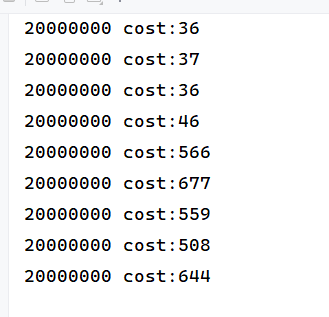

## 五、 共享模型之不可变和共享模型工具

### 不可变的日期转换DateTimeFormatter

```
package tu.learn.test3;

import lombok.extern.slf4j.Slf4j;

import java.time.LocalDate;
import java.time.format.DateTimeFormatter;

@Slf4j(topic = "c.Demo1")
public class Demo1 {
    public static void main(String[] args) {
        DateTimeFormatter dtf = DateTimeFormatter.ofPattern("yyyy-MM-dd");
        for (int i = 0; i < 10; i++) {
            new Thread(() -> {
                LocalDate date = dtf.parse("2024-05-01",LocalDate::from);
                log.debug("{}",date);
            }).start();
        }
    }
}
```

### 自定义一个线程池

```java
package tu.learn.test3;

import javafx.concurrent.Task;
import lombok.extern.slf4j.Slf4j;

import javax.swing.text.StyledEditorKit;
import java.sql.Time;
import java.util.ArrayDeque;
import java.util.Deque;
import java.util.HashSet;
import java.util.concurrent.TimeUnit;
import java.util.concurrent.locks.Condition;
import java.util.concurrent.locks.ReentrantLock;

//步骤1：自定义拒绝策略接口
@FunctionalInterface//拒绝策略
interface RejectPolicy<T>{
    void reject(BlockingQueue<T> queue, T task);
}


//步骤2：自定义任务队列
class BlockingQueue<T> {
    //1.任务队列
    private Deque<T> queue = new ArrayDeque<>();
    //2.锁
    private ReentrantLock lock = new ReentrantLock();

    //3.生产者条件变量
    private Condition fulllWaitSet = lock.newCondition();
    //4.消费者条件变量
    private Condition emptyWaitSet = lock.newCondition();
    //5.容量
    private int capcity;

    public BlockingQueue(int capcity) {
        this.capcity = capcity;
    }

    /**
     * 阻塞获取
     * @return
     */
    public T take(){
        lock.lock();
        try {
            while (queue.isEmpty()){
                try {
                    emptyWaitSet.await();
                } catch (InterruptedException e) {
                    e.printStackTrace();
                }
            }
            T t = queue.removeFirst();
            fulllWaitSet.signal();
            return t;
        }finally {
            lock.unlock();
        }
    }

    /**
     * 带超时的阻塞获取
     * @param timeout
     * @param unit
     * @return
     */
    public T poll(long timeout, TimeUnit unit){
        lock.lock();
        try {
            long nanos = unit.toNanos(timeout);
            while (queue.isEmpty()){
                try {
                    if(nanos <= 0)return null;
                    nanos = emptyWaitSet.awaitNanos(nanos);
                } catch (InterruptedException e) {
                    e.printStackTrace();
                }
            }
            T t = queue.removeFirst();
            fulllWaitSet.signal();
            return t;
        }finally {
            lock.unlock();
        }
    }
    /**
     * 阻塞添加
     * @param element
     */
    public void put(T element){
        lock.lock();
        try{
            while (queue.size() == capcity){
                try {
                    fulllWaitSet.await();
                } catch (InterruptedException e) {
                    e.printStackTrace();
                }
            }
            queue.addLast(element);
            emptyWaitSet.signal();
        }finally {
            lock.unlock();
        }
    }

    /**
     * 带超时时间阻塞添加
     * @param task
     * @param timeout
     * @param timeUnit
     * @return
     */
    public boolean offer(T task,long timeout,TimeUnit timeUnit){
        lock.lock();
        long nanos = timeUnit.toNanos(timeout);
        try{
            while (queue.size() == capcity){
                try {
                    if(nanos <= 0){
                        return false;
                    }
                    nanos = fulllWaitSet.awaitNanos(nanos);
                } catch (InterruptedException e) {
                    e.printStackTrace();
                }
            }
            queue.addLast(task);
            emptyWaitSet.signal();
            return true;
        }finally {
            lock.unlock();
        }
    }
    public int size(){
        return queue.size();
    }

    public void tryPut(RejectPolicy<T> rejectPolicy, T task) {
        lock.lock();
        try{
            if(queue.size() == capcity){
                rejectPolicy.reject(this,task);
            }else{
                queue.addLast(task);
                emptyWaitSet.signal();
            }
        }finally {
            lock.unlock();
        }
    }
}

class ThreadPool{
    //线程集合
    private HashSet<Worker> workers = new HashSet<>();
    //任务队列
    private BlockingQueue<Runnable> taskQueue;

    //核心线程数
    private int coreSize;

    //获取任务的超时时间
    private long timeout;

    private TimeUnit timeUnit;

    private RejectPolicy<Runnable> rejectPolicy;
    /**
     * 执行任务
     * @param task
     */
    public void execute(Runnable task){
        //当任务数没有超过coreSize时，直接交给worker对象执行，否则加入任务队列暂存
        synchronized (workers){
            if(workers.size() < coreSize){
                Worker worker = new Worker(task);
                workers.add(worker);
                worker.start();
            }else{
//                taskQueue.put(task);
                //任务满了后的操作
                //1)死等
                //2)带超时等待
                //3)放弃任务执行
                //4)让调用者抛出异常
                //5)让调用者自己执行任务
                taskQueue.tryPut(rejectPolicy, task);
            }
        }
    }
    public ThreadPool(TimeUnit timeUnit, int coreSize, long timeout,int queueCapcity, RejectPolicy<Runnable> rejectPolicy) {
        this.taskQueue = new BlockingQueue<>(queueCapcity);
        this.coreSize = coreSize;
        this.timeout = timeout;
        this.timeUnit = timeUnit;
        this.rejectPolicy = rejectPolicy;
    }

    class Worker extends Thread{
        private Runnable task;

        public Worker(Runnable task) {
            this.task = task;
        }

        @Override
        public void run() {
            //执行任务，当task不为空执行任务，若task执行完毕，再接着从任务队列获取任务并执行
            while (task != null || (task = taskQueue.poll(timeout,timeUnit)) != null){
                try {
                    task.run();
                } catch (Exception e) {
                    e.printStackTrace();
                } finally {
                    task = null;
                }
            }
            synchronized (workers){
                workers.remove(this);
            }
        }
    }
}
@Slf4j(topic = "c.Demo2")
public class Demo2 {
    public static void main(String[] args) {
        ThreadPool threadPool = new ThreadPool(TimeUnit.MILLISECONDS,1,1000,1,
                //1)死等
//                (queue, task)->{queue.put(task)};
                //2)带超时等待
//                (queue,task) ->{ queue.offer(task,500, TimeUnit.MICROSECONDS);}
                //3)放弃任务执行
                //4)让调用者抛出异常
//                (queue,task)->{throw new RuntimeException("任务执行失败"+task);}
                //5)让调用者自己执行任务
                (queue,task)->{task.run();}
                );
        for(int i = 0; i< 5; i ++){
            int j = i;
            threadPool.execute(()->{
                try {
                    Thread.sleep(1000L);
                } catch (InterruptedException e) {
                    e.printStackTrace();
                }
                log.debug("{}", j);
            });
        }
    }
}
```

### JDK Executors类中提供的方法创建线程池

newFixedThreadPool实现

```java
package tu.learn.test3;

import lombok.extern.slf4j.Slf4j;

import java.util.concurrent.Executor;
import java.util.concurrent.ExecutorService;
import java.util.concurrent.Executors;

@Slf4j(topic = "c.Demo3")
public class Demo3 {
    public static void main(String[] args) {
        ExecutorService pool = Executors.newFixedThreadPool(2);
        //ExecutorService pool = Executors.newCachedThreadPool();
        //ExecutorService pool = Executors.newSingleThreadExecutor();
        pool.execute(()->{
            log.debug("1");
        });
        pool.execute(()->{
            log.debug("2");
        });
        pool.execute(()->{
            log.debug("3");
        });
    }
}
```

### 提交任务

```java
// 执行任务
void execute(Runnable command);

// 提交任务 task，用返回值 Future 获得任务执行结果
<T> Future<T> submit(Callable<T> task);

// 提交 tasks 中所有任务
<T> List<Future<T>> invokeAll(Collection<? extends Callable<T>> tasks)
 throws InterruptedException;

// 提交 tasks 中所有任务，带超时时间
<T> List<Future<T>> invokeAll(Collection<? extends Callable<T>> tasks,
 long timeout, TimeUnit unit)
 throws InterruptedException;

// 提交 tasks 中所有任务，哪个任务先成功执行完毕，返回此任务执行结果，其它任务取消
<T> T invokeAny(Collection<? extends Callable<T>> tasks)
 throws InterruptedException, ExecutionException;

// 提交 tasks 中所有任务，哪个任务先成功执行完毕，返回此任务执行结果，其它任务取消，带超时时间
<T> T invokeAny(Collection<? extends Callable<T>> tasks,
 long timeout, TimeUnit unit)
 throws InterruptedException, ExecutionException, TimeoutException;
```

```java
package tu.learn.test3;

import lombok.extern.slf4j.Slf4j;

import java.util.Arrays;
import java.util.List;
import java.util.concurrent.*;

@Slf4j(topic = "c.Demo4")
public class Demo4 {
    public static void main(String[] args) throws ExecutionException, InterruptedException {
        ExecutorService pool = Executors.newFixedThreadPool(2);
        method1(pool);
        method2(pool);
        method3(pool);
    }

    private static void method3(ExecutorService pool) throws InterruptedException, ExecutionException {
        String str = pool.invokeAny(Arrays.asList(
                () -> {
                    log.debug("begin");
                    Thread.sleep(1000);
                    return "1";
                },
                () -> {
                    log.debug("begin");
                    Thread.sleep(500);
                    return "2";
                },
                () -> {
                    log.debug("begin");
                    Thread.sleep(1000);
                    return "3";
                }
        ));
        log.debug("{}",str);
    }

    private static void method2(ExecutorService pool) throws InterruptedException {
        List<Future<Object>> futures = pool.invokeAll(Arrays.asList(
                () -> {
                    log.debug("begin");
                    Thread.sleep(1000);
                    return "1";
                },
                () -> {
                    log.debug("begin");
                    Thread.sleep(1000);
                    return "2";
                },
                () -> {
                    log.debug("begin");
                    Thread.sleep(1000);
                    return "3";
                }
        ));
        futures.forEach(f->{
            try {
                log.debug("{}",f.get());
            } catch (InterruptedException | ExecutionException e) {
                e.printStackTrace();
            }
        });
    }

    private static void method1(ExecutorService pool) throws InterruptedException, ExecutionException {
        Future<String> submit = pool.submit(new Callable<String>() {

            @Override
            public String call() throws Exception {
                log.debug("running...");
                Thread.sleep(1000);
                return "OK";
            }
        });
        log.debug("{}",submit.get());
    }
}
```

### 关闭线程池

shutdown()和shutdownnow()

```java
package tu.learn.test3;

import lombok.extern.slf4j.Slf4j;

import java.util.List;
import java.util.concurrent.*;

@Slf4j(topic = "c.Demo5")
public class Demo5 {
    public static void main(String[] args) throws ExecutionException, InterruptedException {
        ExecutorService pool = Executors.newFixedThreadPool(2);
        Future<String> submit1 = pool.submit(()->{
                log.debug("running...");
                Thread.sleep(1000);
                return "1";
        });
        Future<String> submit2 = pool.submit(()->{
            log.debug("running...");
            Thread.sleep(1000);
            return "2";
        });
        Future<String> submit3 = pool.submit(()->{
            log.debug("running...");
            Thread.sleep(1000);
            return "3";
        });
//        pool.shutdown();
        List<Runnable> runnables = pool.shutdownNow();
        log.debug("{}",runnables);
    }
}
```

### 创建多个线程应对饥饿现象

```java
package tu.learn.test3;

import lombok.extern.slf4j.Slf4j;

import java.util.Arrays;
import java.util.List;
import java.util.Random;
import java.util.concurrent.ExecutionException;
import java.util.concurrent.ExecutorService;
import java.util.concurrent.Executors;
import java.util.concurrent.Future;

@Slf4j(topic = "c.Demo6")
public class Demo6 {
    static final List<String> MENU = Arrays.asList("地三鲜", "宫保鸡丁", "辣子鸡丁", "烤鸡翅");
    static Random RANDOM = new Random();
    static String cooking() {
        return MENU.get(RANDOM.nextInt(MENU.size()));
    }

    public static void main(String[] args) {
        ExecutorService waiterPool = Executors.newFixedThreadPool(1);
        ExecutorService cookPool = Executors.newFixedThreadPool(1);
        waiterPool.execute(() -> {
            log.debug("处理点餐...");
            Future<String> f = cookPool.submit(() -> {
                log.debug("做菜");
                return cooking();
            });
            try {
                log.debug("上菜: {}", f.get());
            } catch (InterruptedException | ExecutionException e) {
                e.printStackTrace();
            }
        });
        waiterPool.execute(() -> {
            log.debug("处理点餐...");
            Future<String> f = cookPool.submit(() -> {
                log.debug("做菜");
                return cooking();
            });
            try {
                log.debug("上菜: {}", f.get());
            } catch (InterruptedException | ExecutionException e) {
                e.printStackTrace();
            }
        });
    }
}
```

### ScheduledExecutorService延时和定时执行任务

延时：

```java
package tu.learn.test3;

import lombok.extern.slf4j.Slf4j;

import java.util.concurrent.Executors;
import java.util.concurrent.ScheduledExecutorService;
import java.util.concurrent.TimeUnit;

@Slf4j(topic = "c.Demo7")
public class Demo7 {
    public static void main(String[] args) {
        ScheduledExecutorService pool = Executors.newScheduledThreadPool(2);
        pool.schedule(()->{
            log.debug("task1");
        },1, TimeUnit.SECONDS);
        pool.schedule(()->{
            log.debug("task2");
        },1, TimeUnit.SECONDS);

    }
}
```

定时：

```java
package tu.learn.test3;

import lombok.extern.slf4j.Slf4j;

import java.util.concurrent.Executors;
import java.util.concurrent.ScheduledExecutorService;
import java.util.concurrent.TimeUnit;

@Slf4j(topic = "c.Demo7")
public class Demo7 {
    public static void main(String[] args) {
        ScheduledExecutorService pool = Executors.newScheduledThreadPool(2);
        log.debug("starting...");
        pool.scheduleAtFixedRate(()->{
            log.debug("running...");
            try {
                Thread.sleep(1000);
            } catch (InterruptedException e) {
                e.printStackTrace();
            }
        },1,1,TimeUnit.SECONDS);
    }
}
```

### 实现让每周四18：00：00定时执行任务

```java
package tu.learn.test3;

import lombok.extern.slf4j.Slf4j;

import java.time.DayOfWeek;
import java.time.Duration;
import java.time.LocalDateTime;
import java.util.concurrent.Executors;
import java.util.concurrent.ScheduledExecutorService;
import java.util.concurrent.TimeUnit;

@Slf4j(topic = "c.Demo8")
public class Demo8 {
    public static void main(String[] args) {
        ScheduledExecutorService pool = Executors.newScheduledThreadPool(2);

        //获取当前时间
        LocalDateTime now = LocalDateTime.now();

        //获取周四时间
        LocalDateTime time = now.withHour(18).withMinute(0).withSecond(0).withNano(0).with(DayOfWeek.THURSDAY);

        //如果当前时间大于周四，则需要增加一周的时间
        if(now.compareTo(time) > 0)time = time.plusWeeks(1);

        //initialDelay代表当前时间和周四的时间插值
        //period代表间隔时间
        long initialDelay = Duration.between(now,time).toMillis();
        long period = 7*24*60*60*1000;

        pool.scheduleAtFixedRate(()->{
            log.debug("running");
        },initialDelay,period,TimeUnit.MILLISECONDS);
    }
}
```

### fork()/join()实现

计算1-n的合

```java
package tu.learn.test3;


import lombok.extern.slf4j.Slf4j;

import java.util.concurrent.ForkJoinPool;
import java.util.concurrent.RecursiveTask;

@Slf4j(topic = "c.MyTask")
class MyTask extends RecursiveTask<Integer>{
    int n;

    public MyTask(int n) {
        this.n = n;
    }

    @Override
    public String toString() {
        return "{" + n + '}';
    }

    public int getN() {
        return n;
    }

    @Override
    protected Integer compute() {
        // 如果 n 已经为 1，可以求得结果了
        if (n == 1) {
            log.debug("join() {}", n);
            return n;
        }

        // 将任务进行拆分(fork)
        MyTask t1 = new MyTask(n - 1);
        t1.fork();
        log.debug("fork() {} + {}", n, t1);

        // 合并(join)结果
        int result = n + t1.join();
        log.debug("join() {} + {} = {}", n, t1, result);
        return result;
    }
}
public class Demo9 {
    public static void main(String[] args) {
        MyTask myTask = new MyTask(5);
        System.out.println(myTask.fork().join());
//        ForkJoinPool pool = new ForkJoinPool(4);
//        System.out.println(pool.invoke(new MyTask(5)));
    }

}
```

改进

```
package tu.learn.test3;


import lombok.extern.slf4j.Slf4j;

import java.util.concurrent.RecursiveTask;

@Slf4j(topic = "c.MyTask1")
class MyTask1 extends RecursiveTask<Integer>{
    int begin;
    int end;

    public MyTask1(int begin, int end) {
        this.begin = begin;
        this.end = end;
    }

    @Override
    public String toString() {
        return "{" + begin+","+end + '}';
    }

    public int getBegin() {
        return begin;
    }

    public int getEnd() {
        return end;
    }

    @Override
    protected Integer compute() {
        if(begin == end)return begin;
       int mid = (begin + end) / 2;
       MyTask1 t1 = new MyTask1(begin,mid);
       t1.fork();

       MyTask1 t2 = new MyTask1(mid+1,end);
       t2.fork();

       return t1.join() + t2.join();
    }
}
public class Demo10 {
    public static void main(String[] args) {
        MyTask1 myTask = new MyTask1(1,5);
        System.out.println(myTask.fork().join());
//        ForkJoinPool pool = new ForkJoinPool(4);
//        System.out.println(pool.invoke(new MyTask1(5)));
    }

}
```

### 使用AQS实现一个不可重入锁

```java
package tu.learn.test4;

import lombok.extern.slf4j.Slf4j;

import java.util.concurrent.TimeUnit;
import java.util.concurrent.locks.AbstractQueuedSynchronizer;
import java.util.concurrent.locks.Condition;
import java.util.concurrent.locks.Lock;

class MyLock implements Lock{

    class Mysync extends AbstractQueuedSynchronizer{
        @Override
        protected boolean tryAcquire(int arg) {
            if(arg == 1){
                if (compareAndSetState(0,1)){
                    setExclusiveOwnerThread(Thread.currentThread());
                    return true;
                }
            }
            return false;
        }

        @Override
        protected boolean tryRelease(int arg) {
            setExclusiveOwnerThread(null);
            setState(0);
            return true;
        }

        protected Condition newCondition(){
            return new ConditionObject();
        }

        @Override
        protected boolean isHeldExclusively() {
            return getState() == 1;
        }
    }

    Mysync mysync = new Mysync();
    @Override
    public void lock() {
        mysync.acquire(1);
    }

    @Override
    public void lockInterruptibly() throws InterruptedException {
        mysync.acquireInterruptibly(1);
    }

    @Override
    public boolean tryLock() {
        return mysync.tryAcquire(1);
    }

    @Override
    public boolean tryLock(long time, TimeUnit unit) throws InterruptedException {
        return mysync.tryAcquireNanos(1, unit.toNanos(time));
    }

    @Override
    public void unlock() {
        mysync.release(1);
    }

    @Override
    public Condition newCondition() {
        return mysync.newCondition();
    }
}
@Slf4j(topic = "c.Demo1")
public class Demo1 {
    public static void main(String[] args) {
        MyLock lock = new MyLock();
        new Thread(() -> {
            lock.lock();
            try {
                log.debug("locking...");
                try {
                    Thread.sleep(1000);
                } catch (InterruptedException e) {
                    e.printStackTrace();
                }
            } finally {
                log.debug("unlocking...");
                lock.unlock();
            }
        },"t1").start();
        new Thread(() -> {
            lock.lock();
            try {
                log.debug("locking...");
            } finally {
                log.debug("unlocking...");
                lock.unlock();
            }
        },"t2").start();
    }
}
```

### ReentrantReadWriteLock读写锁的例子

```java
package tu.learn.test4;

import lombok.extern.slf4j.Slf4j;

import java.util.concurrent.locks.ReentrantReadWriteLock;

@Slf4j(topic = "c.DataContainer")
class DataContainer{
    private Object data;
    private ReentrantReadWriteLock rw = new ReentrantReadWriteLock();
    private ReentrantReadWriteLock.ReadLock r = rw.readLock();
    private ReentrantReadWriteLock.WriteLock w = rw.writeLock();

    public Object read() throws InterruptedException {
        log.debug("获取读锁");
        r.lock();
        try {
            log.debug("读取：{}",data);
            Thread.sleep(1000);

            return data;
        }finally {
            r.unlock();
        }
    }
    public void write() throws InterruptedException {
        log.debug("获取写锁");
        w.lock();
        try{
            log.debug("写入");
            Thread.sleep(1000);
        }finally {
            w.unlock();
        }
    }
}
@Slf4j(topic = "c.Demo2")
public class Demo2 {
    public static void main(String[] args) {
        DataContainer dataContainer = new DataContainer();
        new Thread(()->{
            try {
                dataContainer.write();
            } catch (InterruptedException e) {
                e.printStackTrace();
            }
        },"write").start();
        new Thread(()->{
            try {
                dataContainer.read();
            } catch (InterruptedException e) {
                e.printStackTrace();
            }
        },"read").start();

    }
}
```

### 使用StampedLock使用带有戳的读锁、写锁

```java
package tu.learn.test4;

import lombok.extern.slf4j.Slf4j;
import sun.util.calendar.LocalGregorianCalendar;

import java.util.concurrent.locks.StampedLock;

@Slf4j(topic = "c.DataContainer1")
class DataContainerStamped{
    private int data;
    private final StampedLock lock = new StampedLock();

    public DataContainerStamped(int data) {
        this.data = data;
    }

    public int read(int readTime) throws InterruptedException {
        long stamp = lock.tryOptimisticRead();
        log.debug("optimistic read locking...{}",stamp);
        Thread.sleep(readTime);
        //检验锁是否一致
        if(lock.validate(stamp)){
            log.debug("read finish...{}",stamp);
            return data;
        }

        log.debug("updating to read lock...{}",stamp);
        try {
            stamp = lock.readLock();
            log.debug("read lock{}",stamp);
            Thread.sleep(readTime);
            log.debug("read finish...{}",stamp);
            return data;
        }finally {
            log.debug("read unlock {}",stamp);
            lock.unlockRead(stamp);
        }
    }

    public void write(int newData) throws InterruptedException {
        long stamp = lock.writeLock();
        log.debug("write lock {}",stamp);
        try{
            Thread.sleep(2000);
            this.data = newData;
        }finally {
            log.debug("write unlock {}",stamp);
            lock.unlockWrite(stamp);
        }
    }
}
public class Demo3 {
    public static void main(String[] args) throws InterruptedException {
        DataContainerStamped dataContainer = new DataContainerStamped(1);
        new Thread(() -> {
            try {
                dataContainer.read(1000);
            } catch (InterruptedException e) {
                e.printStackTrace();
            }
        }, "t1").start();
        Thread.sleep(500);
        new Thread(() -> {
            try {
                dataContainer.write(100);
            } catch (InterruptedException e) {
                e.printStackTrace();
            }
        }, "t2").start();
    }
}
```

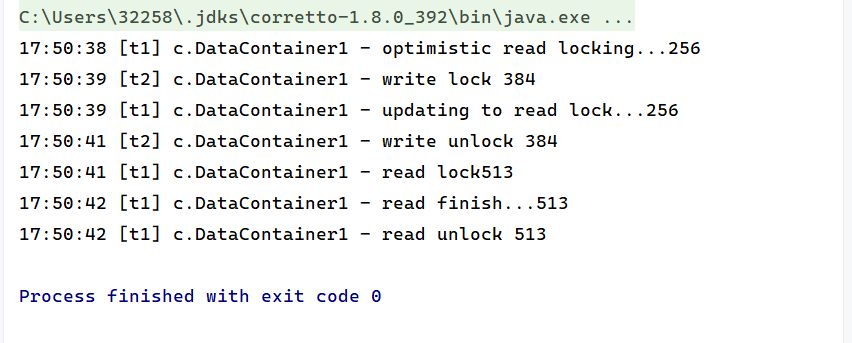

### semaphore基本使用

```
package tu.learn.test4;

import lombok.extern.slf4j.Slf4j;

import java.util.concurrent.Semaphore;

@Slf4j(topic = "c.Demo4")
public class Demo4 {
    public static void main(String[] args) {
        Semaphore semaphore = new Semaphore(3);

        for(int i = 0; i < 10; i ++){
            int j = i;
            new Thread(()->{
                try {
                    semaphore.acquire();
                    Thread.sleep(1000);
                } catch (InterruptedException e) {
                    e.printStackTrace();
                }
                log.debug("{}运行",j);
                semaphore.release();
            }).start();
        }
    }
}
```

### countdownlatch应用之同步等待多线程准备完毕

```
package tu.learn.test4;

import java.util.Arrays;
import java.util.Random;
import java.util.concurrent.CountDownLatch;
import java.util.concurrent.ExecutorService;
import java.util.concurrent.Executors;

public class Demo5 {
    public static void main(String[] args) throws InterruptedException {
        ExecutorService service = Executors.newFixedThreadPool(10);
        CountDownLatch latch = new CountDownLatch(10);
        Random random = new Random();
        String[] all = new String[10];
        for (int j = 0; j < 10; j ++) {
            int k = j;
            service.submit(()->{
               for(int i = 0; i <= 100; i ++){
                   try {
                       Thread.sleep(random.nextInt(100));
                   } catch (InterruptedException e) {
                       e.printStackTrace();
                   }
                   all[k] = i + "%";
                   System.out.print("\r"+Arrays.toString(all));
               }
               latch.countDown();
            });
        }

        latch.await();
        System.out.println("\n游戏开始");
        service.shutdown();
    }
}
```

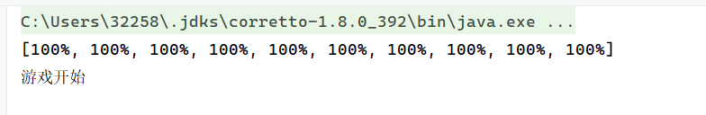

### cyclicbarrier使用

```
package tu.learn.test4;

import lombok.extern.slf4j.Slf4j;

import java.util.concurrent.BrokenBarrierException;
import java.util.concurrent.CyclicBarrier;
import java.util.concurrent.ExecutorService;
import java.util.concurrent.Executors;

@Slf4j(topic = "c.Demo6")
public class Demo6 {
    public static void main(String[] args) {
        ExecutorService service = Executors.newFixedThreadPool(2);
        CyclicBarrier barrier = new CyclicBarrier(2,()->{
           log.debug("task1,task2 finished..");
        });

        for (int i = 0; i < 2; i ++) {
            service.submit(()->{
                try {
                    log.debug("task1 begin...");
                    Thread.sleep(1000);
                    barrier.await();
                } catch (InterruptedException | BrokenBarrierException e) {
                    e.printStackTrace();
                }
            });
            service.submit(()->{
                try {
                    log.debug("task2 begin...");
                    Thread.sleep(1000);
                    barrier.await();
                } catch (InterruptedException | BrokenBarrierException e) {
                    e.printStackTrace();
                }
            });
        }
    }
}
```

### ConcurrentHashMap 实现单词计数

```java
package tu.learn.test4;
import java.io.*;
import java.util.ArrayList;
import java.util.HashMap;
import java.util.List;
import java.util.Map;
import java.util.concurrent.ConcurrentHashMap;
import java.util.concurrent.atomic.LongAdder;
import java.util.function.BiConsumer;
import java.util.function.Supplier;

public class Demo7 {
    public static void main(String[] args) {
        File file=new File("config.properties");
        System.out.println(file.getAbsolutePath());
        System.out.println(System.getProperty("user.dir"));

        demo(
                ()->new ConcurrentHashMap<String, LongAdder>(),
                (map, words)->{
                    for(String word : words){
                        LongAdder longAdder = map.computeIfAbsent(word, (key) -> new LongAdder());
                        longAdder.increment();
//                        Integer counter = map.get(word);
//                        int newValue = counter == null ? 1 : counter + 1;
//                        map.put(word,newValue);
                    }
                }
        );
    }

    private static <V> void demo(Supplier<Map<String, V>> supplier, BiConsumer<Map<String, V>, List<String>> consumer) {
        Map<String, V> counterMap = supplier.get();
        List<Thread> ts = new ArrayList<>();
        for (int i = 1; i <= 3; i++) {
            int idx = i;
            Thread thread = new Thread(() -> {
                List<String> words = readFromFile(idx);
                consumer.accept(counterMap, words);
            });
            ts.add(thread);
        }
        ts.forEach(t -> t.start());
        ts.forEach(t -> {
            try {t.join();
            } catch (InterruptedException e) {
                e.printStackTrace();
            }
        });
        System.out.println(counterMap);
    }
    public static List<String> readFromFile(int i) {
        ArrayList<String> words = new ArrayList<>();
        String path =  i + ".txt";
//        File file = new File(path);
        try (BufferedReader in = new BufferedReader(new InputStreamReader(new FileInputStream(path)))) {
            while (true) {
                String word = in.readLine();
                if (word == null) {
                    break;
                }
                words.add(word);
            }
            return words;
        } catch (IOException e) {
            throw new RuntimeException(e);
        }
    }
}
```
